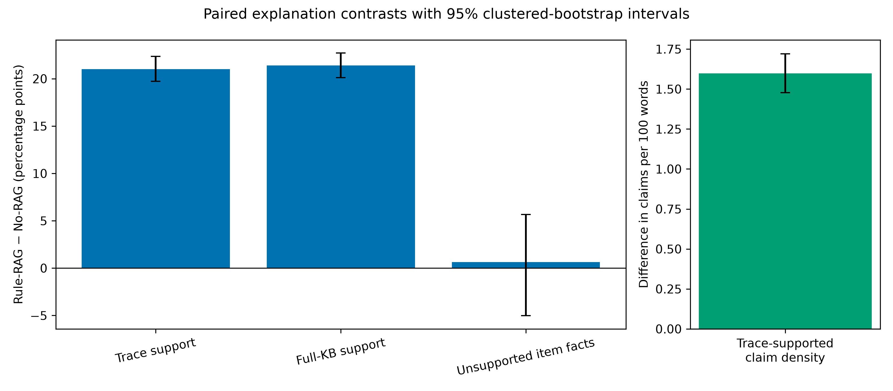

# Declaration

**Candidate action required before submission:** insert the exact declaration wording required by
the applicable University of Salford/PGR template, then sign or otherwise complete it in the
required form. No institutional declaration wording has been invented in this repository.

\newpage

# Acknowledgements

**Candidate action required before submission:** complete or remove this section according to the
candidate's preference and institutional requirements.

\newpage

# Abstract

Multimodal fashion recommenders can use images and product text to rank compatible items, but a
fluent explanation need not reflect evidence that influenced the ranking. This thesis investigates
an evidence-constrained pipeline that links recommendation and explanation through an explicit
decision trace. Frozen CLIP image and text representations rank same-category candidates from
held-out Polyvore outfits. A manually curated, source-grounded experimental knowledge base of 200
fashion rules supplies a separate evidence score; up to five eligible rules are retained as the
symbolic trace used in reranking. The selected item is then locked, and paired No-RAG and Rule-RAG
explanations differ only in access to that trace and its associated grounding instructions.

The recommendation experiment contains 1,000 cases across five categories. Fused CLIP was the
strongest tested method overall on the conventional top-five, top-ten, NDCG, and reciprocal-rank
measures. Evidence reranking changed the top-ranked item in 26.5% of cases but did not improve any
reported aggregate recommendation metric relative to fused CLIP. The explanation experiment used
500 evidence-eligible cases and three local generators. Under generator-specific complete pairing
and case-clustered inference, trace access increased reranking-trace claim support by 21.02
percentage points (95% CI 19.72--22.37) and full-KB claim support by 21.40 points (20.11--22.71).
Trace-supported claims per 100 words increased by 1.60 (1.48--1.72). The common-reference
Unsupported Item-Fact Rate was inconclusive because only 53 complete pairs were eligible.

The principal contribution is therefore not a state-of-the-art ranking claim. It is an auditable
evidence-to-decision-to-explanation connection: the pipeline preserves the exact symbolic evidence
that participated in reranking, reuses that evidence during explanation, and evaluates generated
claims against explicit source boundaries. The result demonstrates stronger trace-grounded support
under the frozen automated evaluator while retaining the negative ranking result and the limits of
a finite curated knowledge base and non-human explanation assessment.

\newpage

# Abbreviations

| Abbreviation | Meaning |
|---|---|
| CI | Confidence interval |
| CLIP | Contrastive Language--Image Pre-training |
| FITB | Fill in the blank |
| HR | Hit rate |
| KB | Knowledge base |
| KG | Knowledge graph |
| LLM | Large language model |
| MRR | Mean reciprocal rank |
| NDCG | Normalised discounted cumulative gain |
| RAG | Retrieval-augmented generation |
| UIFR | Unsupported Item-Fact Rate |

\newpage

# List of figures

- **Figure 4.1.** Paired explanation contrasts with 95% case-clustered bootstrap intervals.

\newpage

# List of tables

- **Table 2.1.** Representative research strands and the gap addressed by this thesis.
- **Table 4.1.** Micro-averaged recommendation effectiveness on 1,000 frozen test cases.
- **Table 4.2.** Overall paired explanation contrasts (Rule-RAG minus No-RAG).

\newpage

# Chapter 1: Introduction
## 1.1 Background and motivation

Fashion recommendation is a demanding application of information retrieval because compatibility is not reducible to simple visual similarity. Two garments may look alike yet serve the same role and therefore be substitutes, while visually dissimilar items may complement one another within an outfit. Early work demonstrated that product images can support large-scale modelling of compatibility and substitution [1]. Later sequence, type-aware, and context-aware approaches represented outfits as structured combinations rather than isolated item pairs [2,3,4]. These developments established that visual and categorical information can improve the ranking of candidate fashion items.

Modern fashion catalogues also contain product text. Titles and descriptions may identify category, brand, material, or style terms that are difficult to infer reliably from pixels, while images contain appearance information that catalogue text may omit. Contrastive vision-language models provide a practical way to combine these signals within a shared representation [5]. A multimodal ranker can therefore exploit complementary image and text evidence without requiring every visual property to be translated into language.

Improved ranking does not, however, make a recommendation self-explanatory. A user may reasonably ask why a particular item was selected, and a system can produce a fluent answer without revealing which information actually influenced the ranking. Explainable-recommendation research has proposed feature-based, review-based, knowledge-graph, path-based, and natural-language rationales [6,7,8,9]. These approaches can improve transparency or persuasiveness, but the existence of a readable explanation does not by itself establish faithfulness to the underlying decision process.

This distinction has become more important with generative language models. Such models can turn sparse catalogue information into polished style advice, but they can also add likely-sounding colours, materials, comfort claims, occasions, or visual relationships that were not supplied to them. In explainable artificial intelligence, plausibility concerns whether an explanation appears reasonable to a reader, whereas faithfulness concerns whether it accurately reflects the mechanism or evidence being explained [10,11,12]. A plausible fashion rationale may therefore be useful as advice while remaining a post-hoc interpretation of the selected product.

Retrieval-augmented generation offers a partial response by displaying external context during generation [13]. Yet retrieved context and decision evidence are not necessarily the same thing. Documents retrieved after an item has been selected may support a persuasive account without showing that those documents participated in selection. Furthermore, access to relevant evidence does not ensure that every generated claim is entailed by it. Citation identifiers can improve auditability, but a citation is only informative when its source actually supports the associated claim [14,15].

The central motivation of this thesis is therefore to connect recommendation and explanation through an inspectable artifact produced during ranking. The implemented system combines CLIP image and text representations with a score derived from curated, source-grounded fashion rules. For every candidate, the rule component retains up to five eligible rules and their contributions. After reranking, the selected recommendation and its exact symbolic trace are frozen. This trace is not a reconstruction created by the explanation model; it records evidence that numerically participated in the ranking decision.

The explanation experiment then holds the selected item constant. For each case and language generator, a No-RAG explanation receives common context A: the request and frozen query and recommended-item identities, categories, and catalogue text. Its paired Rule-RAG explanation receives the same A plus exact trace B. This design isolates access to the symbolic decision trace more closely than comparing explanations of different recommendations. It also permits a necessary terminological distinction: agreement with hidden B is post-hoc decision-trace alignment for No-RAG, while agreement with visible B is decision-trace faithfulness for Rule-RAG.

The study remains deliberately bounded. Images participate in representation and ranking, but they are not captioned and do not become textual explanation evidence. The task is sampled, same-category, controlled-pool ranking over held-out Polyvore outfits rather than personalised, full-catalogue serving. The symbolic trace explains the fashion-rule component of a hybrid reranker, not every internal computation performed by CLIP. Explanation outcomes are measured through a frozen automated pipeline in which Qwen 3.5 9B extracts atomic claims and Phi-4 14B verifies them against the supplied sources. This role separation strengthens auditability, but the results remain operational system evaluation rather than human-validated ground truth.

## 1.2 Problem statement

Existing fashion recommendation research provides increasingly capable representations of item compatibility, but conventional ranking metrics answer only whether relevant items are placed near the top of a candidate list. They do not show whether an explanation accurately describes information used by the system. This creates a gap between recommendation effectiveness and explanation faithfulness.

The gap has three parts. First, high-performing multimodal representations are generally latent. Although an image and its catalogue text can jointly influence a similarity score, the score does not naturally provide a concise verbal account of the decision. Translating latent similarity into unrestricted prose risks presenting an interpretation as if it were an observed causal trace.

Second, post-hoc natural-language explanations can exploit information that did not participate in the recommendation or introduce details absent from the supplied context. In fashion, this problem is particularly visible because descriptions of colour, material, silhouette, formality, season, comfort, and occasion are easy to generate plausibly. An unsupported assertion is not necessarily false in the world, but it is not justified by the evidence available to the generator. Treating unsupported and contradicted claims as equivalent would overstate what the experiment can establish.

Third, standard explanation-quality scores can conceal source-specific failures. Fluency, clarity, specificity, and general usefulness do not directly measure whether claims match the actual decision trace or whether cited rules entail them. A system may receive a high holistic score while misapplying a conditional rule or attaching a valid-looking identifier to an unsupported claim. Explanation evaluation therefore requires measures aligned with the precise evidence boundary.

This thesis addresses these problems through an evidence-aware hybrid architecture and a paired explanation experiment. Curated fashion rules contribute numerically to reranking and are stored as exact trace B. Recommendation effectiveness is evaluated separately from evidence participation. For the same locked recommendation, trace-visible and trace-hidden explanations are compared using reranking-trace claim support, full-knowledge-base claim support, Unsupported Item-Fact Rate (UIFR), citation entailment, and trace-supported claims per 100 words. These measures preserve the distinction between a sentence that is stylistically plausible and a claim that is grounded in an auditable source.

The investigation does not assume that rule reranking improves accuracy. Indeed, the research design permits a negative recommendation result alongside a positive explanation result. This separation is important: a decision may become easier to audit without becoming more relevant, and an explanation may become more faithful to an evidence component whose domain coverage remains imperfect.

## 1.3 Aim, objectives, and research questions

The aim of this thesis is to develop and evaluate an evidence-constrained multimodal fashion recommendation framework in which generated explanations can be assessed against the exact fashion-rule trace used during recommendation.

The first objective is to construct a reproducible controlled-pool fashion-ranking pipeline that combines image and text representations while preventing outfit and exact-image leakage across research splits. This includes deterministic case construction, category-controlled candidate pools, pinned model and dataset revisions, and conventional ranking evaluation.

The second objective is to make source-grounded fashion evidence participate directly in ranking. A curated rule base is filtered and scored for each query-candidate pair, up to five eligible contributions form an evidence score, and a frozen mixture of multimodal compatibility and evidence scores reranks the pool. The complete contributing trace is stored before explanation generation.

The third objective is to compare post-hoc and trace-visible natural-language explanations under a paired design. Both conditions explain the same locked recommendation, use the same generator, decoding settings, and 45--75-word instruction, and differ in access to exact trace B and the associated evidence/citation instructions.

The fourth objective is to evaluate explanation behaviour at claim level. The study distinguishes support from the reranking trace, support from the full final knowledge-base candidate packet, common-reference item-fact support, and citation entailment. It also examines generator and category heterogeneity, complete-pair missingness, and case-clustered statistical uncertainty.

These objectives lead to four research questions:

- **RQ1:** To what extent does providing the exact retained reranking trace during generation improve claim support from that trace and from the final knowledge base, relative to a paired No-RAG baseline?
- **RQ2:** Does providing the trace reduce unsupported concrete item-fact assertions when both conditions are assessed against their common reference evidence?
- **RQ3:** Does citation syntax correspond to claim--rule entailment, rather than merely signalling the appearance of evidence use?
- **RQ4:** Are the observed explanation differences directionally stable across generators and fashion categories under generator-specific complete-pair, case-clustered analysis?

Recommendation effectiveness and evidence participation are supporting questions needed to interpret these RQs. The thesis tests whether multimodal fusion improves ranking relative to the corresponding single-modality CLIP pathways and whether curated fashion evidence materially changes selection. These tests establish what kind of decision the explanations are describing; they are not used to redefine explanation faithfulness as recommendation accuracy.

## 1.4 Scope and boundaries

The empirical dataset is the pinned `Marqo/polyvore` release described in Chapter 3. Held-out outfit co-occurrence supplies an offline relevance proxy. The primary evaluation contains approximately 100 same-category candidates per case and therefore represents sampled controlled-pool ranking. It does not model inventory, price, body fit, temporal preference, individual purchase history, or commercial serving constraints.

The multimodal pathway uses catalogue images and product text. It does not accept unconstrained real-world scene photographs, infer body characteristics, or perform image captioning. Keeping image pixels outside explanation evidence prevents unverified visual descriptions from entering A or B, but it also restricts what a legitimate explanation can say about visible properties.

The final fashion knowledge base contains 200 manually curated, source-grounded styling rules, exactly 40 for each target category: bags, bottoms, outerwear, shoes, and tops. These rules provide an inspectable experimental vocabulary for complementarity, formality, season, colour, and related styling considerations. They are not complete fashion knowledge, independently certified professional advice, verified product metadata, or universal prescriptions. Support from a retrieved rule does not establish that the rule is universally correct for every person or context.

The final experiment is an automated offline systems study. Three local generators produce paired explanations: Gemma 4 12B, Llama 3.1 8B Instruct, and Ministral 3 14B Instruct. Qwen 3.5 9B extracts claims and Phi-4 14B performs binary source verification. Confidence intervals quantify variation across sampled cases, not evaluator error. Human preference, trust, factual catalogue verification, and independent semantic annotation remain outside the completed experimental boundary.

## 1.5 Contributions

This thesis makes four principal contributions. First, it implements an end-to-end architecture in which a source-grounded fashion-rule trace is produced during multimodal reranking and retained for later explanation. Second, it introduces a paired evaluation design that locks recommendation identity, preventing recommendation differences from contaminating the explanation contrast. Third, it operationalises complementary claim-level measures of trace support, full-KB support, item-fact support, and citation entailment. Fourth, it provides a reproducible five-stage workflow with leakage control, validation-only tuning, frozen settings, canonical outputs, configuration hashes, and case-clustered statistical analysis.

The contribution is intentionally not framed as a new state-of-the-art fashion ranker or proof that curated evidence increases relevance. In the final run, fused CLIP achieved the strongest conventional ranking effectiveness overall, while evidence reranking changed the top-ranked item in 26.5% of cases and reduced every reported aggregate ranking metric relative to fused CLIP. For explanations, trace access increased reranking-trace claim support by 21.02 percentage points and full-KB support by 21.40 points under complete-pair, case-clustered analysis; the UIFR comparison was inconclusive because only 53 pairs were eligible. Preserving this mixed result is part of the empirical contribution.

## 1.6 Thesis structure

Chapter 2 reviews fashion compatibility modelling, multimodal ranking, explainable recommendation, retrieval-augmented generation, faithfulness, citation evaluation, and automated assessment. It derives the gap addressed by the implemented study without claiming that evidence can guarantee perfect generation.

Chapter 3 specifies the staged methodology, data controls, multimodal representations, fashion-rule retrieval, reranking, locked explanation intervention, operational metrics, and statistical procedures. Chapter 4 reports recommendation and explanation results, subgroup stability, missingness, statistical checks, and the reproducibility record. Chapter 5 interprets those findings, separates accuracy from evidence alignment, states the limitations, and identifies independent assessment, verified visual evidence, user-centred evaluation, and a dataset-grounded compatibility knowledge graph as future work.

## 1.7 Chapter summary

The research problem is not merely how to generate a compatible fashion recommendation or a fluent explanation. It is how to preserve an inspectable link between part of the ranking process and the language used to justify the selected item, while measuring residual unsupported claims honestly. The thesis addresses this problem through an evidence-participating hybrid reranker, an exact symbolic trace, paired generation for a locked recommendation, and claim-level automated evaluation. The following chapter positions this design against the relevant literature.

\newpage

# Chapter 2: Literature Review
## 2.1 Introduction

This chapter positions the thesis at the intersection of fashion compatibility modelling, multimodal information retrieval, explainable recommendation, retrieval-augmented generation (RAG), and explanation-faithfulness evaluation. These areas address related but distinct questions. Fashion recommendation asks which item is compatible with a query or partial outfit. Multimodal retrieval asks how image and text signals should be represented and combined. Explainable recommendation asks how the basis of a recommendation can be communicated. RAG supplies external context to a generator. Faithfulness research asks whether an explanation accurately reflects the evidence or process it claims to explain.

The completed study does not attempt to solve every problem in these areas. It does not learn a new foundation model, provide personalised full-catalogue serving, or recover the complete internal reasoning of a neural encoder. Its narrower concern is whether a symbolic evidence component can participate in multimodal reranking, be retained as an exact decision trace, and subsequently improve the evidential behaviour of natural-language explanations for the same locked recommendation.

The review proceeds in six parts. Section 2.2 examines the development of fashion compatibility and outfit recommendation. Section 2.3 discusses multimodal representations and the distinction between latent compatibility and verbal evidence. Section 2.4 reviews explainable and knowledge-aware recommendation. Section 2.5 considers generative explanation, RAG, citations, and unsupported claims. Section 2.6 examines faithfulness definitions and evaluation methods. Section 2.7 compares representative studies and derives the research gap that leads directly to the methodology in Chapter 3.

## 2.2 Fashion compatibility and outfit recommendation

### 2.2.1 From visual similarity to compatibility

Fashion recommendation differs from conventional nearest-neighbour retrieval because similarity and compatibility are not identical. A black shoe and a nearly identical black shoe may be substitutes, while a shoe and a pair of trousers can be complementary despite belonging to different visual and semantic categories. A useful representation must therefore model relations between item types rather than assume that the closest item in a generic feature space is the best addition to an outfit.

McAuley et al. [1] provided an influential early formulation by learning visual relationships for styles and substitutes from large-scale product data. Their work showed that convolutional image features can encode notions of compatibility derived from observed relationships. The contribution established visual appearance as a valuable recommendation signal, but the learned distances remain latent and do not directly express why a particular candidate complements a particular query.

Han et al. [2] moved beyond isolated pairs by treating an outfit as an ordered sequence and learning compatibility with bidirectional LSTMs. The forward and backward structure captures dependencies across multiple outfit components and supports fill-in-the-blank evaluation. This work was important because compatibility depends on the surrounding outfit, not only a single pair. Nevertheless, sequence order is an imposed representation of an outfit, and the model’s learned state is not a readily inspectable natural-language decision record.

Vasileva et al. [3] explicitly distinguished similarity from compatibility through type-aware embeddings. Their model learns item-type-specific relations so that comparisons can be conditioned on categories such as tops, bottoms, or shoes. This matches the intuition that different features matter for different cross-category relationships. The associated Polyvore-Outfits dataset and fill-in-the-blank tasks became important resources for compatibility research. The thesis adopts the category-aware principle operationally by constructing same-target-category candidate pools, although it uses frozen pretrained encoders rather than training a type-aware fashion model.

### 2.2.2 Context, graphs, and outfit structure

Cucurull et al. [4] argued that compatibility should depend on item context and proposed graph neural representations conditioned on products known to be compatible. Their results on Polyvore, Fashion-Gen, and Amazon data demonstrated the benefit of relational context over isolated pairwise comparison. Graph-based methods can model higher-order outfit structure, but their explanatory value depends on whether graph paths or learned relationships are exposed and demonstrably used in prediction.

Tan et al. [16] learned similarity conditions without requiring explicit condition labels at test time. By representing distinct semantic subspaces as latent variables, the model improved generalisation across fashion datasets. This line of work illustrates a recurring trade-off: more flexible latent representations can improve predictive capability while making a human-readable account of an individual decision less direct.

Scene-based work further broadened the input boundary. Kang et al. [17] introduced “Complete the Look,” recommending complementary products from real-world scene images rather than isolated catalogue product shots. Scene images may convey pose, environment, and outfit context, but they also introduce clutter and properties that require additional visual inference. The present thesis does not claim this scene-input capability. It operates on catalogue item images within a controlled held-out outfit task and intentionally prevents image-derived attributes from entering the textual explanation evidence.

These studies demonstrate that fashion compatibility benefits from type, context, and multimodal structure. They also show why ranking success and explainability should be evaluated separately. A latent representation can retrieve relevant items effectively while offering no direct proposition that a language generator can cite. Conversely, an interpretable rule may provide a readable reason while failing to improve ranking. The system developed in this thesis therefore retains conventional ranking evaluation and adds a separate, inspectable symbolic evidence pathway.

### 2.2.3 Evaluation conventions and their limits

Fashion compatibility studies commonly use outfit-compatibility classification, fill-in-the-blank tasks, hit rate, mean reciprocal rank, or normalised discounted cumulative gain. Such metrics measure whether held-out positives appear above sampled negatives and whether relevant items occupy favourable ranks [18]. They are appropriate for comparing rankers under a fixed candidate protocol, but their values depend strongly on candidate-pool construction, negative sampling, category restrictions, and the definition of relevance.

Polyvore co-occurrence is a practical but incomplete relevance proxy. An observed outfit provides positive evidence that items were curated together, yet an unobserved candidate is not necessarily incompatible. Fashion permits many plausible alternatives, and user-created outfits encode time, culture, availability, and individual taste. Consequently, the thesis describes its experiment as sampled controlled-pool ranking and does not equate unobserved items with universally poor fashion choices.

Data leakage is another concern. Item identifiers alone may not detect separately listed products containing identical image bytes. If exact images cross development, validation, and test partitions, retrieval results can exaggerate generalisation. The completed implementation therefore groups exact-image hashes at outfit-component level before freezing split assignments. This control extends the outfit-disjoint logic used in prior work and supports a more defensible evaluation, but it does not transform an offline benchmark into an online user study.

## 2.3 Multimodal representation and evidence boundaries

### 2.3.1 Image and text as complementary signals

Catalogue text can expose explicit product terms, while images capture appearance information missing from descriptions. CLIP learns aligned image and text representations from large-scale image-text training and supports zero-shot cross-modal transfer [5]. Its shared embedding space makes it a practical frozen baseline for multimodal catalogue retrieval. In the present system, normalised CLIP image and text vectors are fused before cosine ranking, while MiniLM provides a separate lightweight sentence-embedding pathway [19,20].

The use of frozen general-purpose encoders has advantages and limitations. It permits a reproducible study without end-to-end fashion-model training and allows the research contribution to focus on evidence traces and explanation. However, CLIP is not specialised for outfit compatibility, fit, or subtle garment attributes. Recent work continues to develop attribute-augmented compatibility prediction [21] and fine-grained text-conditioned outfit generation and retrieval [22]. The present work does not seek to establish a new state-of-the-art outfit-compatibility architecture; it investigates the effect of explicit retrieved fashion evidence on recommendation decisions and faithful explanation. Its multimodal pathway is therefore treated as a reproducible baseline rather than the strongest possible fashion representation.

The completed results support a bounded multimodal claim. Fused CLIP is the strongest tested pathway on the principal top-five and top-ten retrieval measures, while the evidence reranker produces a modest relevance trade-off in exchange for an inspectable symbolic trace. The literature therefore motivates multimodal representation, whereas the experiment reserves its main causal claim for the subsequent evidence-grounded explanation contrast.

### 2.3.2 Representation is not textual evidence

A critical distinction for this thesis is that an image embedding is a ranking signal, not a set of verified textual attributes. A similarity score may be affected by colour, silhouette, pattern, composition, or correlations that are not individually recoverable. Generating an explanation that states “the burgundy trousers match the leather shoes” would require evidence that the items are burgundy and leather. The fact that CLIP processed their images does not establish that these particular propositions were explicitly represented or causally decisive.

The system therefore draws a strict evidence boundary. Images enter the recommendation pathway but are never captioned or classified into explanation facts. Common context A contains the user request and the frozen item identities, categories, and catalogue text. Exact trace B contains the complete retained set of source-grounded fashion rules and scoring information used by the evidence component. A future image-evidence block could contain separately validated visual attributes, but such a component would require its own benchmark and uncertainty controls.

This boundary avoids an important category error in multimodal explanation. Visual grounding normally asks whether language corresponds to observable image content. Decision faithfulness asks whether language reflects information used in a prediction. These properties can overlap but are not interchangeable. The thesis evaluates faithfulness to B and support from A+B while acknowledging that B is only the symbolic portion of a hybrid score.

## 2.4 Explainable recommender systems

### 2.4.1 Purposes and forms of recommendation explanation

Explanations in recommender systems serve several possible goals: transparency, scrutability, trust calibration, persuasion, satisfaction, and support for better decisions [6,9]. These objectives can conflict. A persuasive explanation may increase acceptance without accurately exposing the recommendation process; a technically faithful trace may be difficult for a user to understand. Evaluation must therefore match the stated purpose.

Zhang and Chen [6] survey explainable recommendation approaches including neighbourhood, matrix-factorisation, topic, graph, deep-learning, and natural-language methods. Feature-based explanations can identify influential attributes; review-based methods can reuse user-authored evidence; path-based systems can expose relations between users and products. Natural-language generation can improve accessibility, but it introduces another model whose output may diverge from the recommendation evidence.

Knijnenburg et al. [9] demonstrate that system effectiveness, explanation properties, user perceptions, and experience are distinct levels of evaluation. Their framework cautions against treating accuracy as a proxy for explanation usefulness or treating subjective appeal as proof of system fidelity. The completed thesis does not include a user study, so it confines its claims to system-level operational measures and automated judgments.

### 2.4.2 Post-hoc and mechanism-linked explanations

Post-hoc explanations are produced after a prediction and may approximate its basis through surrogate features, attention, retrieved examples, or generated rationales. They can be valuable, but their fidelity must be tested rather than assumed. Attention weights, for example, have generated substantial debate over when they constitute explanations and what kind of causal claim they support [11].

Mechanism-linked approaches instead incorporate interpretable components into prediction. Policy-Guided Path Reasoning uses knowledge-graph paths to connect users and recommended items [7]. LOGER combines knowledge-graph embeddings with neural logic rules and uses learned rule importance to guide path reasoning for explainable recommendation [8]. These systems demonstrate that paths or rules can be part of recommendation rather than decoration added afterwards.

The present work shares the goal of mechanism linkage but differs in architecture and question. It does not learn personalised logical rules over a user-item knowledge graph. It filters a curated, source-grounded fashion-rule base, calculates a candidate evidence score from up to five eligible contributions, mixes that score with fused CLIP, and stores the exact contributing trace. It then experimentally tests what happens when a separate language generator can or cannot see that trace while recommendation identity remains locked.

### 2.4.3 Limits of symbolic evidence

An interpretable component is not automatically correct. A generic rule may be sensible in the abstract but only partially applicable to a specific query-candidate pair. Semantic retrieval may select a rule whose antecedent is not established. Reliability categories supplied with a rule base are not empirical probabilities. A faithful explanation can therefore accurately report questionable evidence.

This distinction separates three evaluation targets. Recommendation metrics examine whether the hybrid system ranks held-out outfit items. Evidence-participation diagnostics examine whether the rule component materially changes selection and whether diverse rules are used. Explanation metrics examine whether generated language matches the stored trace and avoids unsupported instance-level claims. No single target validates the other two.

The thesis consequently avoids describing its architecture as perfectly faithful “by construction.” B is exact as a data record of the symbolic scoring calculation, but generated prose can omit, distort, or overgeneralise it. Trace support, full-KB support, and citation-entailment evaluation exist precisely because exposure to the trace does not guarantee correct use.

## 2.5 Retrieval-augmented generation and cited explanations

### 2.5.1 Retrieval as external context

RAG combines parametric generation with retrieved external information [13]. It has become a common strategy for improving factuality and updating knowledge without retraining the generator. In recommendation, retrieved reviews, catalogue fields, knowledge-graph facts, or domain guidance can support conversational answers and item justifications.

However, “retrieved,” “visible,” and “used” describe different relationships. A document can be retrieved but excluded from a prompt; it can be displayed but ignored by the generator; it can influence wording without having influenced item selection. Standard RAG commonly grounds the answer in visible context, but it does not necessarily connect that context to the upstream recommendation decision.

This thesis uses the term Rule-RAG for the explanation condition because rules are retrieved and displayed to the generator. Its stronger architectural property is that the displayed retained trace is identical to the trace used in the evidence score for the locked item. Even so, the language generator is prompted rather than token-constrained. It remains capable of adding unsupported content, and the empirical citation results confirm that rule identifiers are not always attached correctly.

### 2.5.2 Hallucination, unsupportedness, and contradiction

Hallucination terminology varies across language-generation research. Ji et al. [23] review factual inconsistency and distinguish errors relative to sources from errors relative to world knowledge. For this study, the supplied evidence boundary is more observable than world truth. A claim is unsupported when A and B do not entail it, contradicted when the supplied evidence entails its opposite, and not verifiable when the evidence is insufficient for the applicable schema.

This vocabulary matters in fashion. If a model calls a bag leather when neither item text nor trace establishes material, the claim may happen to be true. The experiment can show that it is unverified by supplied evidence, not that it is factually false. Conversely, contradiction is rare because sparse catalogue context seldom states the opposite of a generated style assertion. Collapsing unsupported and contradicted categories would inflate the apparent detection of falsehood.

The final study's common-reference item-fact metric focuses conservatively on concrete claims about actual query or recommended items. Subjective relational claims and ambiguous statements are excluded from its denominator. This sacrifices coverage to make the estimand clearer and explains why the final complete-pair UIFR analysis has a much smaller eligible sample than the primary support outcomes.

### 2.5.3 Citations as claim-source relations

Cited generation makes source use inspectable, but citation presence alone is inadequate. Gao et al. [14] evaluate systems that generate text with citations and distinguish correctness from completeness. Later fine-grained work shows that automatic citation-faithfulness metrics vary in their ability to distinguish full, partial, and absent support [15]. These findings motivate claim-level treatment rather than counting bracketed identifiers.

The thesis adopts citation precision and coverage. Precision asks whether a cited rule entails the associated claim. Coverage asks whether claims requiring rule support receive at least one valid citation. A generator can have high citation frequency but low precision if identifiers are decorative or attached to over-broad claims. It can have high precision but low coverage if it cites a small supported subset while leaving many rule-dependent claims uncited.

The exact rule trace enables deterministic identifier validation and source-aware verification. Yet citation entailment is still assessed automatically, and the cross-model verifier frequently returned null or structurally inconsistent citation relations even when identifiers were present. The final results therefore treat strict citation coverage as weak and evaluator-dependent, illustrating that marker presence is not a formal guarantee of claim–source support.

## 2.6 Faithfulness and evaluation

### 2.6.1 Plausibility, faithfulness, and the object of explanation

Jacovi and Goldberg [10] argue that faithfulness must be defined relative to a model and an explanation target. An explanation should correspond to the process it purports to describe rather than merely satisfy human expectations. Wiegreffe and Pinter [11] likewise show that debates about explanation require explicit claims and tests. Lyu et al. [12] organise faithful-explanation research into similarity-based, model-internal, gradient, counterfactual, and self-explaining approaches, illustrating that no single measure applies universally.

For a hybrid recommender, the object of explanation must be stated precisely. The CLIP component produces a latent compatibility score; the rule component produces an auditable score from up to five eligible contributions. B is a complete record of the latter but not the former. “Decision-trace faithfulness” in this thesis therefore means faithfulness to the symbolic evidence trace used within the decision, not full causal explanation of the hybrid model.

The No-RAG condition creates a useful comparison. A pretrained generator may mention concepts similar to hidden B because fashion rules are common cultural knowledge. Such agreement is evidence of post-hoc alignment, not grounding, because the generator did not receive B. This prevents a high baseline match rate from being misrepresented as evidence use.

### 2.6.2 Functional and human-grounded evaluation

Explanation evaluation can be functionally grounded, application grounded, or human grounded. Functional measures test formal or computational properties without users. Human-grounded experiments use simplified tasks with people, while application-grounded work evaluates explanations with intended users or domain experts. Each supports different claims.

The completed experiment is functionally grounded and automated. Qwen 3.5 extracts atomic claims and Phi-4 verifies each claim against the trace, full-KB packet, common reference, and observed citations. Deterministic post-processing derives the final support rates and density from saved records. This permits evaluation of thousands of claims under reproducible schemas but introduces evaluator dependence.

Automated RAG-evaluation frameworks such as ARES show how model judges can assess context relevance, answer faithfulness, and answer relevance at scale [24]. Such frameworks often use human-labelled examples for calibration or prediction-powered inference. The present thesis does not include independent human calibration, so its confidence intervals capture case-sampling variability rather than semantic evaluator uncertainty. The limitation constrains interpretation but does not erase the value of a controlled system comparison.

### 2.6.3 Atomic claims and aggregation

Whole-response labels can hide mixed support. An explanation may contain one trace-supported styling relation, two unsupported product attributes, and a correct item identity. Atomic claim extraction enables these components to be assessed separately. It also introduces boundary decisions: conjunctions may be split inconsistently, pronouns may obscure the target item, and conditional language may be converted into overly definite propositions.

Both micro and macro aggregation are therefore useful. Claim-micro rates weight explanations with more extracted claims more heavily. Explanation-macro rates first calculate within-explanation proportions and then average units. Paired macro differences compare the same case-generator combination across conditions, while clustered bootstrap intervals recognise that several generator outputs derive from the same recommendation case.

Eligibility creates additional denominator differences. UIFR cannot be calculated for an explanation with no eligible concrete item-fact claims. Marginal condition rates therefore use different eligible explanation populations, while paired estimates use only the intersection in which both explanations contain an eligible claim. Reporting these denominators prevents a visually simple percentage from concealing a change in what the generator chose to claim.

### 2.6.4 Length and evaluator dependence

Explanation length is a major design issue. Longer outputs create more opportunities to state unsupported attributes, while concise evidence-focused prompts may improve both density and readability. Normalising unsupported claims per 100 words reduces but does not remove this difference because evidence access and brevity can affect which claims are selected, not only how many words are produced.

Both final conditions received the same 45--75-word instruction. Across accepted outputs, No-RAG explanations averaged 62.10 words and Rule-RAG explanations averaged 64.83 words, a difference of 2.72 words. The shared contract reduces an obvious design asymmetry, but evidence and citation instructions can still affect rhetorical structure and realised length. The primary trace-support outcome is therefore complemented by trace-supported claims per 100 words.

Evaluator independence is related but distinct. Using the same model family for extraction and verification can create correlated errors. The final run therefore uses Qwen 3.5 for atomic-claim extraction and Phi-4 for verification. This is stronger role separation, though neither model is human-calibrated. Cross-model assessment reduces one source of correlated error but does not substitute for annotation or establish semantic correctness.

## 2.7 Comparative synthesis and research gap

### 2.7.1 Comparison of representative research

Table 2.1 compares the main strands that lead to the thesis. The “remaining gap” column identifies a limitation relative to this study’s question, not a defect in the cited work. For example, a fashion-compatibility paper need not generate explanations to make a valid contribution; it simply leaves explanation faithfulness unresolved.

| Study | Research focus | Method and evidence | Main contribution | Remaining gap leading to this thesis |
|---|---|---|---|---|
| McAuley et al. [1] | Visual styles, substitutes, and compatibility | Visual features and learned product relations | Established large-scale visual compatibility modelling | Learned distance does not provide an exact natural-language decision trace |
| Han et al. [2] | Whole-outfit compatibility | Bidirectional sequence model on Polyvore outfits | Modelled dependencies across multiple garments | Sequential hidden state is not directly auditable as explanation evidence |
| Vasileva et al. [3] | Type-aware similarity and compatibility | Category-conditioned visual embeddings and Polyvore-Outfits | Distinguished within-type similarity from cross-type compatibility | Strong representation learning remains separate from claim-level explanation support |
| Chia et al. [25] | Transferable fashion product representation | Fashion-domain contrastive image–text adaptation of CLIP | Demonstrated gains from domain-specific fashion representation learning | Does not connect representation scores to an exact rule trace or assess generated decision explanations |
| Cucurull et al. [4] | Context-aware compatibility | Graph neural network over item context | Demonstrated value of higher-order relational context | Graph representation alone does not establish that generated prose follows the decision mechanism |
| Kang et al. [17] | Scene-based complementary recommendation | Real-world scene images, CNN compatibility, and attention | Extended recommendation beyond isolated catalogue queries | Visual context requires separate verified textualisation before it can support factual explanations |
| Zhang and Chen [6] | Explainable recommendation | Survey of feature-, review-, graph-, and generation-based methods | Organised goals, methods, and evaluation of explainable recommenders | Highlights heterogeneous explanation objectives; no single operational trace test follows automatically |
| Xian et al. [7] | Explainable knowledge-graph recommendation | Policy-guided multi-hop path reasoning | Connected recommendation to interpretable user-item paths | Focuses on personalised KG paths rather than paired LLM explanations of a frozen hybrid decision |
| Zhu et al. [8] | Faithful logic-based recommendation | Neural logic rules, KG embeddings, and path reasoning | Made rule importance part of recommendation and explanation | Does not test unsupported product claims or citation integrity in free natural-language generation |
| Lewis et al. [13] | Retrieval-augmented generation | Retrieved documents combined with parametric generation | Established a general architecture for retrieved-context generation | Retrieved context may be visible without being part of the upstream recommendation decision |
| Gao et al. [14] | Citation-supported generation | Retrieval, cited long-form generation, and citation metrics | Separated citation correctness and completeness | Addresses document-supported generation rather than recommendation-specific decision traces |
| Jacovi and Goldberg [10] | Definition of explanation faithfulness | Conceptual framework for faithfulness and plausibility | Requires explicit model, explanation target, and criteria | Needs a domain-specific operationalisation for hybrid recommenders |
| Lyu et al. [12] | Faithful NLP explanation | Survey of more than 100 explanation approaches | Shows diversity of faithfulness definitions and tests | Does not itself provide metrics for unsupported fashion-item attributes or rule citations |
| Saad-Falcon et al. [24] | Automated RAG evaluation | Synthetic training, lightweight judges, and calibrated estimation | Demonstrates scalable component-level RAG assessment | Automated judges remain estimator-dependent and do not replace explicit decision provenance |

*Table 2.1. Representative research strands and the gap addressed by this thesis.*

### 2.7.2 Research gaps

The comparison reveals four connected gaps. The first is a **decision-provenance gap**. Fashion rankers increasingly exploit visual, textual, categorical, and relational representations, but their natural-language explanations are often not connected to an exact artifact that participated in selecting the item. A readable account can therefore become a plausible reconstruction of latent compatibility.

The second is an **evidence-use gap**. RAG supplies external information to a generator, but information retrieved for explanation may differ from information used during ranking. Even when the same source is visible, generation remains capable of ignoring, blending, or overgeneralising it. The relevant architectural question is not merely whether rules can be retrieved, but whether the displayed rules are demonstrably the rules used by an evidence component before explanation.

The third is a **claim-specific evaluation gap**. General quality, fluency, and hallucination scores do not isolate agreement with a stored decision trace, unsupported concrete item attributes, or claim-citation entailment. Recommendation explanations require measures that respect the difference between generic styling advice and assertions about actual catalogue items.

The fourth is an **objective-separation gap**. Explainability mechanisms are sometimes justified through accuracy gains, while faithful explanations are sometimes treated as evidence that a recommendation is better. These are different propositions. A rule component can change ranking without improving relevance, and a generator can explain that component faithfully even when the component is incomplete. A defensible evaluation should report recommendation effectiveness, evidence participation, and explanation behaviour separately.

### 2.7.3 How the thesis addresses the gap

Chapter 3 responds with a staged architecture and evaluation design. First, it constructs deterministic outfit-disjoint and exact-image-leakage-resolved splits from a pinned Polyvore release. Second, it establishes MiniLM, CLIP image, CLIP text, and fused CLIP ranking pathways under controlled same-category candidate pools. Third, it filters and scores eligible rules for each query-candidate pair, retains up to five, calculates an evidence score, combines that score with fused CLIP, and preserves the exact scoring trace.

Fourth, the selected recommendation is locked before language generation. The No-RAG and Rule-RAG conditions explain the same item for the same request and generator. Common context A is identical; Rule-RAG additionally receives trace B. Fifth, saved explanations are decomposed into claims and evaluated with source-aware automated schemas. Trace support distinguishes post-hoc agreement from grounding in visible B; full-KB support captures the broader rule packet; common-reference item-fact support remains a restricted secondary outcome; and citation entailment measures a claim--source relation rather than identifier presence. Generator and category analyses provide complementary robustness views.

This design does not make unsupported generation impossible. Instead, it makes the relationship between a symbolic decision component and generated language observable and measurable. It also retains negative evidence: if reranking does not improve recommendation accuracy, or if citations remain invalid, those outcomes constrain rather than invalidate the contribution.

## 2.8 Chapter summary

Fashion recommendation research has progressed from pairwise visual relationships to sequence, type-aware, graph, scene, and multimodal representations. Explainable recommendation has progressed from readable features and reviews to knowledge-graph paths and logic-guided reasoning. RAG and citation research provide mechanisms for supplying and auditing external context, while faithfulness research warns that plausible language and visible evidence do not prove dependence on a decision process.

The unresolved intersection concerns provenance: whether an inspectable evidence trace can participate in recommendation, be preserved before generation, and support a controlled comparison of explanations for the same selected item. The thesis addresses that intersection through a hybrid multimodal and rule-based reranker, paired trace visibility, and claim-level automated evaluation. The next chapter formalises the data, scoring trace, experimental freezing, metrics, and statistical procedures used to test the resulting research questions.

\newpage

# Chapter 3: Methodology
## 3.1 Introduction

This chapter describes the research design, implementation, and evaluation procedure used to investigate evidence-constrained multimodal fashion recommendation. The central methodological problem was not simply to produce a plausible recommendation. It was to separate three questions that are often conflated: whether a multimodal ranker retrieves compatible items; whether source-grounded fashion evidence materially participates in the ranking decision; and whether a natural-language explanation is faithful to the stored decision trace without adding unverified product attributes. The experiment was therefore organised as a staged, frozen pipeline. Earlier stages prepared the data, representations, candidate pools, and rule base; validation-only stages fixed every tunable choice; the confirmatory recommendation experiment then locked one recommendation and its exact retrieved-rule trace for each case; and the explanation experiment compared two texts for the same locked decision.

The design follows a paired-comparison principle. For each explanation case, common context A contained the request, query-item text and identity, and locked recommended-item text and identity. Exact trace B contained the eligible rules, up to the configured maximum of five, that contributed to the frozen evidence score. The No-RAG generator received A alone. The Rule-RAG generator received A and B, while recommendation identity was held constant. This intervention isolates access to the decision trace at the explanation stage. It does not isolate every possible effect of prompt wording or output length, and it does not turn the No-RAG condition into a grounded explanation when its text happens to agree with B. Accordingly, B agreement in No-RAG is post-hoc alignment, whereas Rule-RAG support is evidence-grounded because B was visible during generation.

The work is an offline systems experiment rather than a user study. Recommendation relevance comes from co-occurrence within held-out Polyvore outfits. Explanation assessment uses Qwen 3.5 to extract atomic claims and Phi-4 to verify their relationship to the exact trace, the full KB packet, common reference evidence, and citations. Deterministic post-processing derives support rates and trace-supported-claim density from saved records. These are operational measures for this study, not universal benchmarks. No human or independent external audit is included in the final experimental boundary, so the automated evaluation is treated as system-level evidence with explicit limitations.

## 3.2 Research questions and experimental logic

The methodology addresses four linked research questions. RQ1 asks whether making the exact fashion-rule trace visible during generation improves support by the actual reranking trace and by the final KB packet. RQ2 asks whether the same intervention changes the rate of eligible concrete item-fact claims that are unsupported by a common reference packet. RQ3 asks whether syntactically present Rule-RAG citations are entailed by the cited rules at claim level. RQ4 asks whether the primary support effects remain directionally stable across the three generators and five target categories.

The causal contrast is deliberately narrow. For case \(q\), let \(r_q\) be the recommendation locked in Stage 2, \(A_q\) the common case context, and \(B_q\) the exact retrieved-rule trace. For generator \(g\), the two outputs are

\[
\begin{aligned}
E^{\mathrm{NoRAG}}_{qg} &= G_g(A_q),\\
E^{\mathrm{RuleRAG}}_{qg} &= G_g(A_q,B_q).
\end{aligned}
\tag{3.1}
\]

Both outputs explain the same \(r_q\). The paired elements are the case, locked recommendation, generator, decoding configuration, and common context. The intervention is the availability of \(B_q\): Rule-RAG receives the exact trace and associated grounding instruction, whereas No-RAG does not. Both conditions receive the same 45--75-word instruction. The contrast therefore identifies the effect of trace-grounded prompting, while recognising that the evidence and citation instructions are part of that intervention. Claim outcomes are reported as rates and, where appropriate, per 100 generated words.

Equation (3.1) is not intended to claim that the generator has access to hidden neural states. It formalises the visible-information boundary of the experiment. The recommendation is already fixed before either call, and \(B_q\) is a recorded symbolic artifact rather than a newly retrieved explanatory document. This ordering is what permits a comparison of explanation grounding without conflating it with a change in the recommendation itself.

The study does not claim that B is a complete account of a neural model’s internal computation. B is instead the exact, inspectable symbolic trace used by the evidence component of the deployed reranker. The term “decision trace” is thus architectural and operational: it identifies the retained fashion rules, their similarities, ordering, and contributions used to compute the evidence score. Faithfulness is measured relative to that trace. This boundary follows the distinction in explainable-AI research between a convincing rationale and an account tied to the mechanism being explained [10,11].

## 3.3 Staged research design and freezing policy

The final project was implemented in five frozen stages. Stage 1 performed preflight, audited the final 200-rule KB, fixed the dataset/split and validation-only settings, and bound prompts and configurations. Stage 2 executed 1,000 recommendations and 3,000 fresh explanation attempts. Stage 3 extracted atomic claims from accepted explanations. Stage 4 verified claims against the frozen evidence packets and applied the documented deterministic logical-consistency invariant. Stage 5 derived final tables, figures, paired bootstrap inference, release hashes, and quality checks without new model calls.

Freezing served two purposes. First, it prevented test performance from influencing model weights, fusion weights, evidence weights, pool size, rule count, or prompts. Second, it preserved a stable provenance chain. Each major artifact was written once, bound to a SHA-256 digest, and named in a stage manifest. Model identifiers were accompanied by immutable revisions or local model digests. Configuration objects were canonicalised and hashed. Stage 5 derived all final analysis from the saved Stage 1--4 records and made zero new model calls.

The final confirmatory settings were fixed before Stage 2: image/text CLIP fusion was 0.40/0.60; evidence reranking was CLIP/evidence 0.75/0.25; up to five eligible rules contributed to each trace; and the primary candidate pool contained approximately 100 candidates. Larger pools were validation sensitivity settings rather than alternative primary estimates. Generator identities, decoding settings, Rule-RAG prompt form, and claim schemas were frozen before full generation. The authorised verifier-contract correction is separately recorded in final provenance and binds the release to the actual Stage-4 prompt hash.

## 3.4 Data source, unit of analysis, and preprocessing

### 3.4.1 Dataset and fields

The data source was the `Marqo/polyvore` dataset at immutable revision `8c782ee447faf2d2a0402ac883cf07d3b3f43e1c`, configuration `default`, source split `data`, and fingerprint `9c97dc763773e2a2`. Polyvore-derived outfit data are widely used for fashion compatibility research because an outfit supplies a set of items curated to appear together [1,2]. The present study used only the raw item identifier, category, product text, outfit association, and image. Textual explanation evidence was intentionally limited: images entered the recommendation representation but were never captioned, classified, or converted into attributes for A or B.

The pinned source contained 94,096 raw item rows. The validated five-category mapping retained 47,872 eligible items across 19,094 outfits: bags, bottoms, outerwear, shoes, and tops. These prepared counts, rather than intermediate raw-dataset counts, define the frozen split and the confirmatory experiment.

### 3.4.2 Outfit-disjoint splitting

The outfit, not the item row, was the primary split unit. Outfit IDs were ordered by SHA-256 over a fixed seed and assigned to exact quotas of 13,365 development outfits, 2,864 validation outfits, and 2,865 test outfits. This procedure is deterministic and prevents items from the same outfit appearing on opposite sides of the research split. Within the test partition, case selection used a separate seeded SHA-256 order and sampled 200 cases for each broad category, producing 1,000 confirmatory recommendation cases.

Exact duplicate images were audited by hashing image bytes. Eighteen duplicate groups were identified, of which nine crossed the initial research split. Outfits connected by shared exact-image hashes were treated as connected components. Each cross-split component was moved to the split of its lowest seeded-hash anchor; singleton outfits were then moved in a separate deterministic order to restore the original quotas. Twelve outfits changed assignment in total: nine component reassignments and three quota-restoring reassignments. The final split retained its exact quotas and contained no cross-split outfit or exact-image leakage. This is stricter than relying on unique item IDs, because separately identified catalogue rows can still carry identical visual content.

### 3.4.3 Query construction and candidate pools

Each case selected a query item and a target category representing the missing outfit component. All known same-outfit positives in that target category were retained. Negatives were sampled from items of the same target category belonging to other test outfits. The query item was always excluded. Category restriction makes the task a controlled within-category ranking problem: the model chooses *which* pair of shoes or *which* top, rather than receiving credit merely for predicting the requested item type.

Stage 2 used up to 99 same-category negatives together with all known positives for each of the 1,000 confirmatory cases. Pool sizes can exceed 100 when a case has multiple retained positives. The design is therefore sampled controlled-pool ranking rather than full-catalogue retrieval. Absolute ranking values must be interpreted within this fixed test regime; they do not estimate production-scale catalogue retrieval performance.

## 3.5 Representation learning and baseline retrieval

### 3.5.1 Text representation

The text-only baseline used `sentence-transformers/all-MiniLM-L6-v2` at immutable revision `1110a243fdf4706b3f48f1d95db1a4f5529b4d41`. Sentence-BERT-style encoders map sentences into a shared dense space suitable for cosine retrieval [19], while MiniLM distils transformer self-attention into a more compact architecture [20]. Product text was encoded into 384-dimensional float32 vectors and L2 normalised. Texts were truncated only according to the pinned encoder limit of 256 tokens. This pathway provided a lightweight semantic baseline distinct from CLIP text encoding.

### 3.5.2 CLIP image and text representation

The multimodal ranker used `openai/clip-vit-base-patch32` at immutable revision `3d74acf9a28c67741b2f4f2ea7635f0aaf6f0268`. CLIP learns aligned visual and language representations from image–text pairs [5]. Item images and product text were embedded into 512-dimensional float32 vectors. All vectors were L2 normalised, and Stage-1 preflight confirmed maximum norm errors below \(1.2\times10^{-7}\). Distinct input items also produced non-zero pairwise distances, ruling out degenerate caches.

For a query with normalised image vector \(v_q\) and text vector \(t_q\), the fused query representation was

\[
z_q=\alpha v_q+(1-\alpha)t_q,
\qquad
f_q=\frac{z_q}{\lVert z_q\rVert_2},
\qquad \alpha=0.40.
\tag{3.2}
\]

with \(\alpha=0.40\) in the frozen confirmatory system. Candidate \(i\) received CLIP compatibility

\[
s_{\mathrm{CLIP}}(q,i)=f_q^{\top}f_i.
\tag{3.3}
\]

which is cosine similarity because the vectors are normalised. Separate CLIP-image and CLIP-text baselines used their respective query and candidate modalities without fusion. Deterministic item-ID ordering resolved exact score ties.

### 3.5.3 Validation of fusion and computation boundary

Fusion weights were examined on validation data only. The validation search established the behaviour of the fusion surface, after which the authoritative study specification fixed 0.40 image/0.60 text for the Stage-2 confirmatory run. The test set was not used to retune this choice. Representations were cached and hash-bound so that ranking and statistical calculations did not repeatedly invoke the encoders.

The experiment records parameter counts, quantisation, device choices, token counts, latency, and model digests where available. It does not report floating-point operations (FLOPs). Accurate FLOP accounting for cached transformer embeddings and quantised Ollama generation would require kernel-level profiling, batch-shape accounting, and a definition of how integer/quantised operations are converted to FLOPs. Those counters were not captured during the frozen runs. A retrospective theoretical estimate would therefore create spurious precision and is not required for any effectiveness or faithfulness claim. The publication analysis itself made zero model calls.

## 3.6 Curated fashion rule base and exact decision trace

### 3.6.1 Knowledge-base construction

The final knowledge base contained 200 curated rules, exactly 40 for each recommended category: bags, bottoms, outerwear, shoes, and tops. Every record carried a stable rule identifier, rule text, recommended category, applicable query grouping, and provenance. The knowledge base was supplied and frozen; the project did not use automatic rule authoring.

Rules express styling relationships rather than verified catalogue facts. Examples include complementarity between apparel types, consistency of formality, seasonal layering, or matching dominant colours. This distinction is essential. A generic instruction to recommend colour-compatible items can support the reason for seeking compatibility, but it cannot prove the actual colour of a particular candidate or that a particular pair definitely matches. The common-reference item-fact analysis therefore uses strict instance-level entailment and does not convert prescriptive advice into product metadata.

### 3.6.2 Rule retrieval and scoring

For each query–candidate pair, the system created a textual representation from the query category and text, user request, candidate category and text, and target category. Rules were filtered before scoring by recommendation category and by explicit applicability gates for query group, required context, query terms, and candidate terms. Semantic similarity between the pair representation and rule text was calculated using normalised `qwen3-embedding:0.6b` vectors. The final experiment assigned every retained rule the same weight and no category bonus. Rule \(r\) therefore received

\[
u(q,i,r)=\cos(e_{q,i},e_r).
\tag{3.4}
\]

where \(e_{q,i}\) is the candidate representation and \(e_r\) is the rule embedding. Rules were sorted by contribution with stable rule-ID tie-breaking, and up to \(k=5\) eligible rules were retained. Fewer rules were retained when fewer than five passed the applicability gates; empty traces remained explicit zero-evidence cases and were not backfilled with merely similar rules.

For the retained set \(R_k(q,i)\), the candidate evidence score combined its maximum and mean contribution,

\[
s_E(q,i)=0.7\max_{r\in R_k(q,i)}u(q,i,r)
+0.3\frac{1}{\lvert R_k(q,i)\rvert}\sum_{r\in R_k(q,i)}u(q,i,r).
\tag{3.5}
\]

The stored trace included every element needed to reproduce this number: the candidate ID; representation hash; filter counts; retained rule IDs and texts; retrieval rank; similarity; the recorded equal weight and zero bonus; contribution; and final evidence score. B is therefore not a later summary generated for the explanation model. It is the exact trace of the rules that participated in the reranking score.

## 3.7 Evidence-aware reranking and recommendation locking

Raw CLIP and evidence scores have different ranges. Within each candidate pool, min–max normalisation converted each to \([0,1]\):

\[
\widetilde{s}(i)=
\begin{cases}
\dfrac{s(i)-\min_j s(j)}{\max_j s(j)-\min_j s(j)}, & \max_j s(j)>\min_j s(j),\\
0, & \max_j s(j)=\min_j s(j).
\end{cases}
\tag{3.6}
\]

If all candidates shared the same score, the deterministic implementation handled the zero range without introducing random noise. The final reranking score was

\[
s_R(q,i)=0.75\,\widetilde{s}_{\mathrm{CLIP}}(q,i)+0.25\,\widetilde{s}_{E}(q,i).
\tag{3.7}
\]

The 0.75/0.25 setting was chosen through a validation-only Pareto procedure that considered recommendation effectiveness and evidence participation rather than optimising a single metric. Candidate-pool size, rule count, and weights were frozen before testing. The top-ranked reranked item became the locked recommendation. The Stage-2 explanation calls could explain this item but could not replace it. This lock is the methodological bridge between recommendation and explanation experiments: both conditions refer to the same decision, and the trace used for Rule-RAG is the trace stored for that item during reranking.

Evidence participation was evaluated independently of hit-rate effectiveness. Diagnostics included whether reranking changed the top item or ordered top five, set overlap at five and ten, mean absolute rank shift in the top-ten union, gains in evidence score at several cut-offs, rule coverage, and Shannon entropy of rule use. This avoids the erroneous inference that a non-significant accuracy difference means the evidence component did nothing. Conversely, substantial reordering does not establish improved recommendation accuracy.

## 3.8 Recommendation evaluation

### 3.8.1 Relevance and metrics

An item was relevant if it belonged to the query outfit and matched the requested target category. Multiple positives were allowed. For ranked relevance sequence \(rel_k\), hit rate at \(K\) was

\[
\operatorname{HR@}K=\mathbb{1}\!\left(\sum_{k=1}^{K} rel_k>0\right).
\tag{3.8}
\]

Discounted cumulative gain was

\[
\operatorname{DCG@}K=\sum_{k=1}^{K}\frac{2^{rel_k}-1}{\log_2(k+1)},
\qquad
\operatorname{NDCG@}K=\frac{\operatorname{DCG@}K}{\operatorname{IDCG@}K}.
\tag{3.9}
\]

and \(NDCG@K=DCG@K/IDCG@K\), where IDCG is the ideal ranking for that case [18]. Reciprocal rank was \(RR=1/r\) for the rank \(r\) of the first relevant result and zero if no relevant result appeared. Mean reciprocal rank averaged RR across cases. The reported primary cut-off was ten, with ranks one and five retained for diagnostic resolution.

Five frozen confirmatory methods were compared: MiniLM text, CLIP image, CLIP text, fused CLIP, and evidence reranking. Metrics were reported as micro estimates over cases, by target category, and as category macro estimates. The main scientific contrast compared fused CLIP with evidence reranking, because this isolates the addition of the evidence score to the same multimodal base. The frozen run did not add post-confirmatory representation baselines or retune the primary system.

### 3.8.2 Statistical inference

Cases were not treated as fully independent when they shared a query outfit. Recommendation confidence intervals therefore used the query outfit as the bootstrap cluster. For each of 5,000 replicates, complete query-outfit clusters were sampled with replacement, all their cases were retained, and the statistic was recomputed. The 2.5th and 97.5th percentiles formed a 95% interval [26]. The released recommendation table reports percentile intervals for each method and metric; it does not report pairwise recommendation p-values or a multiple-comparison test. The test set was not used to choose a weight, prompt, or model.

## 3.9 Explanation-generation experiment

### 3.9.1 Common context A

For every locked case, A contained the complete frozen common information made available to both generators: the user request; query-item ID, category, and product text; and locked recommended-item ID, category, and product text. The displayed prompt used minimal names, while the saved packet retained identity and category provenance. No image caption, visual detector, outside catalogue lookup, brand knowledge, or inferred fashion attribute was added.

### 3.9.2 Exact trace B and conditions

B contained the complete retained trace described in Section 3.6, with between one and five rules for the evidence-eligible explanation cases. It was hidden from No-RAG generation but retained in the frozen record for paired assessment. The No-RAG prompt asked for an explanation of why the locked item suited the request using A and imposed the same 45–75-word contract used by Rule-RAG. The Rule-RAG prompt displayed A and B, included rule IDs and rule text, required at least one exact trace citation, and used the same numerical limits. A/B hashes were stored with every generation record. Thus the word-budget assignment is controlled, although observed word counts and the additional Rule-RAG instructions are not identical.

The No-RAG condition represents an unconstrained post-hoc rationale, not a condition with no information: it can use explicit product text in A. The Rule-RAG condition represents trace-assisted generation. A claim that restates an explicit material term from a product title may therefore be A-supported in either condition. A claim that follows a styling rule may be B-supported. A claim that invents “waterproof”, “premium leather”, or a definite instance-level colour match without such evidence is unsupported by the supplied evidence, but is not automatically factually false.

### 3.9.3 Generators and decoding

Three local, digest-pinned instruction models generated the explanations: Gemma 4 12B, Llama 3.1 8B Instruct Q8_0, and Ministral 3 14B Instruct Q4_K_M. The generator roster and decoding configuration were frozen before the full run. Each case--generator combination was attempted in both conditions under the same locked recommendation and common context; only the Rule-RAG prompt received the stored trace.

Five hundred locked, evidence-eligible cases were sampled from the final recommendation run, balanced with 100 cases each for bags, bottoms, outerwear, shoes, and tops. Crossing 500 cases, three generators, and two conditions produced 3,000 attempted explanation cells. Every prompt, response, latency, word count, model digest, and content hash was preserved. Outputs were immutable after generation. Stage 2 accepted 2,969 cells; the 31 terminal failures were all Llama Rule-RAG outputs that exceeded the shared 75-word limit after the permitted retries. Final comparisons therefore use generator-specific complete pairs only.

## 3.10 Validation-only configuration freezing

Before the full run, validation-only sensitivity grids examined fusion and evidence-reranking settings. They were used to freeze an image/text mixture of 0.40/0.60, a CLIP/evidence mixture of 0.75/0.25, and a maximum of five retrieved rules per candidate. The grids are reported as validation evidence rather than pooled with the confirmatory results; no final recommendation, explanation, extraction, or verification outcome was selected after observing the test results.

The final Rule-RAG configuration was also frozen before generation. It displayed the complete non-empty retained trace in score order with stable IDs and rule text; it required at least one exact trace citation and imposed the same 45–75-word limits used in No-RAG. Validation work set this contract and the ranking settings, but no pilot outcome is combined with the final estimates. The confirmatory corpus is solely the 3,000 Stage-2 attempted cells and the frozen Stage-3 and Stage-4 assessments derived from accepted outputs.

## 3.11 Atomic-claim extraction and verification

### 3.11.1 Extraction

The complete explanation, rather than a sentence sample, was passed to a frozen Qwen 3.5 9B extractor. The extractor enumerated independent atomic fashion or styling propositions, split independently checkable conjunctions, assigned sequential claim IDs, and applied the frozen claim schema. Extraction assessed neither truth nor support. Of 2,969 accepted explanations, 2,965 accepted extractions yielded 17,710 atomic claims; four terminal extraction failures were retained as missing records rather than repaired.

Claim role was assigned deterministically after extraction. `item_type` claims were identity/context claims because they commonly state what item is being recommended. The other schema labels were treated as substantive because even simple categories such as colour and material can carry explanatory content. Records that failed extraction or verification were retained as terminal failures and were not assigned invented claim labels.

### 3.11.2 Multi-source verification

Phi-4 14B verified each extracted claim against complete context A, exact trace B, the record-specific full-KB candidate packet, and observed citations. The final schema preserves four distinct outcomes: `trace_support`, `full_kb_support`, `common_reference_support`, and `citation_entailment`. A `not_supported` value means that the specified evidence packet does not entail the claim under the frozen closed-world protocol; it is not a statement that the claim is false.

Using Phi-4 for verification separates the verifier from the Qwen 3.5 extractor and from the three explanation generators. Stage 4 accepted 2,861 verification records covering 16,804 claims; 104 terminal verification records were retained rather than imputed. A deterministic consistency correction then changed only `full_kb_support` from `not_supported` to `supported` for 163 claims that were trace-supported after confirming that the trace rule occurred in the same record's full-KB packet. This enforces the trace-subset invariant without adding a semantic judgement or rerunning a model.

## 3.12 Study-specific explanation metrics

### 3.12.1 Reranking-trace claim support

For an explanation \(E\) with extracted claims \(C(E)\), reranking-trace claim support is the proportion supported by the exact trace \(B_q\):

\[
\operatorname{TraceSupport}(E)=
\frac{\sum_{c\in C(E)}\mathbb{1}\!\left[\operatorname{trace\_support}(c)=\mathrm{supported}\right]}
{\lvert C(E)\rvert}.
\tag{3.10}
\]

The numerator counts only claims with the canonical `trace_support = supported` label. The denominator is the number of verified claims in that explanation. For No-RAG, a positive label is post-hoc agreement with hidden B; for Rule-RAG, it is support from evidence made visible at generation. Aggregate results use generator-specific complete pairs and case-clustered resampling rather than unpaired marginal totals.

### 3.12.2 Full-KB and common-reference support

Full-KB support uses the same verified claim set but asks whether a claim is supported anywhere in that record's final KB candidate packet. It is broader than trace support: it establishes knowledge-grounding, not that the supporting rule numerically contributed to reranking. The final invariant requires every trace-supported claim to be full-KB-supported.

\[
\operatorname{FullKBSupport}(E)=
\frac{\sum_{c\in C(E)}\mathbb{1}\!\left[\operatorname{full\_kb\_support}(c)=\mathrm{supported}\right]}
{\lvert C(E)\rvert}.
\tag{3.11}
\]

For UIFR, \(C_I(E)\) contains only eligible concrete item-fact claims. Explanations with no eligible claim receive no invented zero, and the paired UIFR comparison includes only cases eligible in both conditions. This deliberately restrictive denominator is why UIFR is secondary and much less precise than the support-rate outcomes.

For the restricted eligible item-fact claims \(C_I(E)\), the common-reference Unsupported Item-Fact Rate is

\[
\operatorname{UIFR}(E)=
\frac{\sum_{c\in C_I(E)}\mathbb{1}\!\left[\operatorname{common\_reference\_support}(c)=\mathrm{not\_supported}\right]}
{\lvert C_I(E)\rvert}.
\tag{3.12}
\]

This is a sensitivity metric, not the primary measure, because the opportunity to make claims does not necessarily grow linearly with words.

### 3.12.3 Citation entailment

Citation metrics apply only to Rule-RAG. A cited claim is valid only when an observed rule citation intersects the verifier’s exact supporting rule IDs, the rule supports the claim, and citation entailment is true:

\[
\operatorname{CitationEntailment}(E)=
\frac{\sum_{c\in C_{\mathrm{cited}}(E)}\mathbb{1}\!\left[\operatorname{citation\_entailment}(c)=\mathrm{entails}\right]}
{\lvert C_{\mathrm{cited}}(E)\rvert}.
\tag{3.14}
\]

No-RAG is reported as N/A, not zero. Precision and coverage are distinct from citation presence. A model can cite frequently yet attach the wrong rule, or cite validly on selected claims while leaving other rule-dependent claims uncited.

### 3.12.4 Scope of the metric set

The final metric set deliberately keeps distinct evidence boundaries rather than collapsing them into one broad grounding score. Trace support is the primary decision-faithfulness outcome, full-KB support is the broader rule-grounding outcome, UIFR is the restricted common-reference item-fact sensitivity, and citation entailment evaluates a cited Rule-RAG relation. No separate condition-specific support score or evidence-overreach rate is reported, because the frozen Stage-4 schema does not provide a common denominator or an independently annotated partial-entailment scale for either construct.

## 3.13 Final paired inference

For every final explanation outcome, the estimand was the paired Rule-RAG minus No-RAG difference. Analysis first retained complete pairs within each generator: 474 for Gemma, 438 for Llama, and 456 for Ministral. Generator-specific differences were then averaged within a case whenever more than one generator pair was available, yielding 498 paired cases for the primary analysis. This avoids treating unequal marginal condition totals as if they formed paired observations.

For metric \(m\), the case-level contrast was

\[
\widehat{\Delta}_m=
\frac{1}{|Q|}\sum_{q\in Q}
\left(\frac{1}{|G_q|}\sum_{g\in G_q}d_{qg}^{(m)}\right).
\tag{3.15}
\]

where \(d_{qg}^{(m)}\) is the generator-specific paired difference and \(G_q\) is the set of complete generator pairs for case \(q\). Percentile 95% confidence intervals were obtained from 5,000 bootstrap resamples of case IDs. Holm correction [27] was applied to the predeclared family of primary support, UIFR, and trace-density contrasts. Citation entailment is summarised descriptively for Rule-RAG because it has no No-RAG counterpart.

## 3.14 Heterogeneity, robustness, and qualitative analysis

Primary trace-support, full-KB-support, and trace-density differences were estimated separately for the three generators and five categories using the same complete-pair rule. These subgroup estimates test directional stability rather than generalisation beyond the evaluated roster. UIFR subgroup analyses are especially cautious because the common-reference item-fact criterion yields a small jointly eligible set.

Missingness was retained as an observable property of the pipeline. The 31 terminal explanation failures were confined to Llama Rule-RAG outputs that exceeded the shared word cap after permitted retries; this produces the smaller Llama complete-pair count and rules out a misleading all-generator balanced-total calculation. Four accepted explanations did not yield accepted claim extraction, and 104 verification records remained terminal. Neither source corpus was silently completed, imputed, or regenerated. Stage 5 reports attempted and accepted denominators alongside the complete-pair analysis, and support rates are calculated only from the verified claims available under the frozen schema. This is conservative: it preserves the distinction between an unobserved assessment and a claim that the verifier labelled not supported.

The bootstrap unit also follows the pairing structure rather than the number of generated texts. A case can contribute up to three generator-specific pairs, so resampling every text independently would understate uncertainty by treating correlated outputs as unrelated observations. Resampling case IDs retains all complete generator pairs for each selected case and repeats the within-case averaging rule. Generator-specific estimates retain their own complete pairs, while category summaries are based on the same frozen case and generator identifiers. This makes the overall and subgroup analyses traceable to one coherent unit of inference, even though the available pair counts differ across generators.

The analysis distinguishes support prevalence from claim opportunity. A shorter text can contain fewer substantive propositions, whereas a longer text can provide more opportunities both for supported relational statements and for unsupported item details. Trace-supported-claim density, expressed per 100 generated words, therefore complements the support-rate outcomes. UIFR does not receive a forced denominator adjustment because its eligibility is defined by the presence of concrete item-fact claims in both conditions; its restricted complete-pair estimate is reported separately rather than extrapolated to explanations that made no eligible assertion. These choices make the final estimands narrower, but also prevent a broad claim of factual reliability from being inferred from a source-specific support result.

Qualitative examples were selected from frozen records to illustrate the distinction between relational styling statements and unsupported candidate attributes, along with the use and limits of rule citations. Examples preserve their common context, trace, generated text, and canonical assessment fields. They aid interpretation but do not replace corpus-level estimates.

## 3.15 Reproducibility, software, and ethical boundaries

The implementation used Python 3.12 on Windows 11. Embedding and LLM stages were configured for CUDA where available. The repository pins dependencies through `uv.lock`, model revisions or immutable local digests, dataset revision, random seeds, and canonical configuration hashes. Major tables, figures, JSONL corpora, and manifests are SHA-256 bound. Ruff linting and the project test suite cover data leakage, deterministic ranking, rule retrieval, prompt separation, schemas, refusal handling, statistics, artifact integrity, and the trace-support-to-full-KB-support invariant. Stage 5 validates principal output hashes and records the release boundary.

The study uses catalogue images and descriptions from a research dataset and makes no inference about protected personal attributes. It is not a safety-critical wardrobe adviser, product-authentication system, or factual catalogue service. Product text may be noisy, and outfit co-occurrence reflects platform curation rather than universal taste. Generated explanations must therefore be read as system outputs about supplied records, not authoritative fashion or product claims.

Automated assessment presents a more important validity limitation. Qwen 3.5 9B extracts claims and Phi-4 14B verifies them; this separates claim construction from entailment but does not establish either model's semantic accuracy. The restricted UIFR definition improves source-boundary transparency but cannot resolve every mixed natural-language claim. No human ratings, independent external annotations, or partial-entailment audit are included. The strongest warranted conclusion is comparative: under this frozen system evaluator, access to the exact retained trace changes measured trace support, full-KB support, trace-supported-claim density, and citation-related provenance. It does not establish human preference, factual correctness in the world, or causal faithfulness to every internal neural computation.

## 3.16 Chapter summary

The methodology connects recommendation and explanation through a locked decision and an exact symbolic trace. Multimodal CLIP retrieval supplies the base ranking; a filtered, source-grounded fashion rule base contributes an evidence score; validation-only selection freezes the fusion and reranking design; and the confirmatory evaluation quantifies both recommendation effectiveness and ranking change. The explanation experiment holds recommendation identity constant while varying access to B across three generators and five categories. Atomic claims, trace and full-KB support, common-reference UIFR, citation entailment, complete-pair inference, subgroup estimates, and frozen qualitative examples provide complementary views of the output.

The design’s principal strength is traceability. Every reported explanation is connected to a specific A packet, B trace, generator digest, locked candidate, claim list, and verification record. Its principal limitation is equally clear: the final thesis experiment stops at automated system evaluation. Chapter 4 therefore reports quantitative differences without treating them as independently human-validated truth.

## 3.17 Validity controls and decision rules

Several controls were applied before results were interpreted. Construct validity was protected by refusing to collapse all explanation properties into a single “grounding” score. Trace support addresses agreement with the actual rule trace, full-KB support addresses broader rule grounding, UIFR addresses a narrow class of concrete product assertions, and citation entailment addresses whether an attached rule supports its claim. These measures can move differently. For example, an explanation can accurately paraphrase B while adding an unsupported material claim, or it can use a citation that does not entail the proposition it accompanies. Reporting each rate separately prevents one favourable dimension from concealing another failure.

Internal validity depended on pairing and freezing. The recommendation, A packet, B packet, generator, and case were identical within each No-RAG/Rule-RAG comparison. Outputs were not edited to equalise length, remove refusals, repair citations, or improve examples. Stage-2 generation records were hashed before assessment, and Stage-3 and Stage-4 outputs were preserved before deterministic metric derivation. Model selection and hyperparameter search were confined to development or validation data. These controls do not remove the prompt-and-length difference intrinsic to the intervention, but they prevent test-driven tuning and recommendation changes from contaminating the explanation contrast.

Statistical-conclusion validity was addressed through the appropriate dependence unit. Recommendation cases can share an outfit, so recommendation intervals resample query outfits. Explanation texts from three generators can share a case, so Stage-5 analyses resample case IDs after averaging complete generator-specific pairs within case. Micro and macro estimates answer different questions and are not treated as interchangeable: micro rates weight explanations in proportion to their number of claims, whereas macro rates weight each eligible explanation equally. The UIFR paired result has the additional jointly eligible restriction; it therefore describes texts that actually make concrete item-fact claims on both sides and is not extrapolated to all complete pairs.

External validity is bounded by the sampled catalogue, five broad categories, controlled pools, three local quantised generators, and supplied rule base. The system does not model individual user histories, price, availability, body measurements, culture-specific dress norms, or time-varying trends. Outfit co-occurrence is a useful offline relevance signal but does not prove that every held-out item would be preferred by a new user. Larger candidate pools show the expected reduction in absolute ranking performance and caution against treating the approximately 100-candidate estimates as full-catalogue serving results.

Reliability was supported by deterministic execution and independent re-computation from stored artifacts. SHA-256 ordering replaced random iteration in split, case, tie, and example selection. Generation used greedy deterministic settings, while structured assessment calls retained model digests and raw-response hashes. Each derived table can be traced to a manifest listing input and output hashes. Re-running the publication analysis does not invoke a model; it combines immutable records, recomputes rates and cluster resamples, and recreates figures and examples.

Finally, interpretation followed pre-specified language rules. A claim labelled unsupported is described as “unsupported by supplied evidence” or an “unverified item-specific assertion”, never as factually false unless affirmative contradiction exists. No-RAG agreement with hidden B is post-hoc alignment, never grounding. UIFR is explicitly described as inconclusive because its restricted eligible set is small. Evidence reranking is described as materially changing ranks and evidence alignment, not as improving recommendation accuracy, because the fused-CLIP contrasts do not establish an improvement. These linguistic constraints are part of the methodology: they keep the thesis claims proportional to the estimands actually measured.

\newpage

# Chapter 4: Results
## 4.1 Introduction

This chapter reports the frozen final five-stage experiment. Every result is derived from the canonical Stage 1--5 artifacts; no model was called during final analysis. Results follow the pipeline: preflight, recommendation evaluation, explanation generation, extraction and verification, then paired claim-level contrasts. A claim described as unsupported is unsupported by the supplied source under the frozen protocol; it is not thereby false in the world. Citation syntax is also kept separate from citation entailment.

The explanation intervention is narrow and controlled. No-RAG and Rule-RAG explain the same locked recommendation for the same case and generator. Both receive common context A. Rule-RAG alone receives the complete retained reranking trace B. The experiment therefore measures the effect of making stored decision evidence available during generation, rather than comparing explanations of different recommendations.

## 4.2 Final preflight and frozen design

Stage 1 passed the final preflight gate. Dataset and split inputs, embeddings, candidate-pool construction, prompts, schemas, and output hashes were frozen before confirmatory work. The final knowledge base contains 200 curated fashion rules, exactly 40 each for bags, bottoms, outerwear, shoes, and tops. The audit confirmed unique identifiers, complete provenance, and no exact or threshold-defined near duplicates.

Validation-only grids fixed the operational point: image/text fusion of 0.40/0.60, CLIP/evidence reranking of 0.75/0.25, and a maximum of five eligible rules per candidate. These checks are not pooled with confirmatory results. Crucially, the complete retained trace saved during reranking is the same record supplied as Rule-RAG evidence. No separate explanation-time retrieval occurred.

## 4.3 Recommendation results

The recommendation evaluation contained 1,000 held-out cases, 200 per category, drawn from 734 underlying query outfits. Confidence intervals use 5,000 percentile bootstrap replicates clustered by query outfit. The task remains controlled same-category candidate-pool ranking, with held-out outfit co-occurrence as an offline relevance proxy.

\Needspace{18\baselineskip}

| Method | HR@1 | HR@5 | HR@10 | NDCG@5 | NDCG@10 | MRR |
| --- | ---: | ---: | ---: | ---: | ---: | ---: |
| MiniLM text | 4.8% | 12.0% | 17.7% | 8.4% | 10.3% | 10.2% |
| CLIP image | 3.2% | 12.6% | 22.0% | 7.9% | 10.9% | 10.0% |
| CLIP text | 3.5% | 13.8% | 21.2% | 8.6% | 11.0% | 10.1% |
| Fused CLIP | 4.5% | 14.3% | 23.1% | 9.4% | 12.2% | 11.4% |
| Evidence rerank | 3.8% | 13.2% | 22.5% | 8.5% | 11.4% | 10.6% |

*Table 4.1. Micro-averaged recommendation effectiveness on 1,000 frozen test cases. Values are shown as percentages; unrounded estimates and confidence intervals remain in the released table.*

Fused CLIP was the strongest tested conventional retrieval pathway. Evidence reranking did not improve these aggregate relevance measures, so it must not be presented as an accuracy improvement. It did, however, change the top-ranked recommendation in 26.5% of cases, with mean top-five overlap of 3.859, mean top-one evidence-score gain of 0.1473, and mean pre-to-post rank shift of 0.566. One hundred and forty-eight of the 200 rules occurred in at least one locked trace. The symbolic component therefore materially participated in the decisions it later helped explain.

## 4.4 Explanation completion and pairing

Five hundred evidence-eligible locked recommendations, balanced at 100 cases per category, formed the explanation study. Gemma 4 12B, Llama 3.1 8B Instruct, and Ministral 3 14B Instruct generated both conditions, giving 3,000 attempted cells. Stage 2 accepted 2,969 explanations. The 31 terminal failures were all Llama Rule-RAG responses exceeding the shared 75-word limit after permitted retries; none was replaced or silently repaired.

Final inference therefore uses generator-specific complete pairs: Gemma 474, Llama 438, and Ministral 456. For the overall estimate, generator-level within-case differences are averaged before resampling, leaving 498 underlying cases with at least one complete generator pair. This prevents multiple generator outputs for a case being treated as independent observations and avoids raw unequal condition totals.

## 4.5 Extraction and verification completion

Qwen 3.5 9B extracted atomic claims from the 2,969 accepted explanations. Stage 3 accepted 2,965 extraction records containing 17,710 claims; four terminal extraction failures were retained. Phi-4 14B then verified claims against A, the exact trace, the full-KB candidate packet, and observed citations. Stage 4 accepted 2,861 verification records covering 16,804 claims. The 104 terminal verification failures remain in the canonical missingness record.

The verifier preserves separate fields for `trace_support`, `full_kb_support`, `common_reference_support`, and `citation_entailment`. Of the verified claims, 2,058 were trace-supported and 2,095 were supported by the full KB packet. Common-reference support was 961 supported, 13 not supported, and 15,830 not applicable. Citation entailment was 1,820 entails, 5,502 does not entail, and 9,482 not applicable.

A deterministic correction addressed 163 logically impossible labels where trace support was supported but full-KB support was not supported. For every affected claim, the trace rule was confirmed to occur in its full-KB packet. Only the full-KB label was changed to supported; no model was rerun and no other field was altered. The final invariant is explicit: trace support implies full-KB support.

## 4.6 Paired explanation results

Primary contrasts use 5,000 paired percentile bootstrap replicates clustered by underlying case [26], with Holm adjustment across four prespecified overall metrics [27]. Table 4.2 presents Rule-RAG minus No-RAG. Positive values favour Rule-RAG except for UIFR, where lower is preferable.

For metric \(m\), the reported effect is the average within-case difference after first averaging the available generator-specific complete-pair differences:

\[
\widehat{\Delta}_m=
\frac{1}{|Q|}\sum_{q\in Q}
\left(\frac{1}{|G_q|}\sum_{g\in G_q}
\bigl[m(E^{\mathrm{RuleRAG}}_{qg})-m(E^{\mathrm{NoRAG}}_{qg})\bigr]\right).
\tag{4.1}
\]

Here, \(Q\) is the set of underlying cases with at least one complete pair and \(G_q\) is the available generator set for case \(q\). The expression clarifies why three generator outputs for one case are not treated as three independent cases.

\Needspace{18\baselineskip}

| Metric | Paired cases | Difference | 95% CI | Holm-adjusted p |
| --- | ---: | ---: | ---: | ---: |
| Reranking-trace claim support rate | 498 | +21.02 pp | +19.72 to +22.37 pp | 0.0016 |
| Full-KB claim support rate | 498 | +21.40 pp | +20.11 to +22.71 pp | 0.0016 |
| Unsupported Item-Fact Rate | 53 | +0.63 pp | -5.03 to +5.66 pp | 0.9042 |
| Trace-supported claims per 100 words | 498 | +1.60 | +1.48 to +1.72 | 0.0016 |

*Table 4.2. Overall paired explanation contrasts (Rule-RAG minus No-RAG). Rate differences are percentage points; density remains in claims per 100 words.*

Rule-RAG substantially increased claims supported by both the exact trace and the wider final KB packet. The increase of 1.60 trace-supported claims per 100 words shows that the result is not merely an effect of output volume. For No-RAG, agreement with hidden B is post-hoc alignment; for Rule-RAG, support is evidence-grounded because B was available in the prompt.

Figure 4.1 visualises the four contrasts on their correct units, separating rate differences from claim density.

{width=95%}

*Figure 4.1. Paired explanation contrasts with 95% case-clustered bootstrap intervals.*

UIFR is inconclusive. It applies only when both paired explanations contain the relevant common-reference item-fact claim type, leaving 53 pairs. The interval includes both small benefit and small harm, so it cannot justify a corpus-wide claim that Rule-RAG reduces item-fact overreach.

## 4.7 Robustness, citations, and research questions

The primary support effects were positive for every generator. Trace-support differences were +25.09 percentage points for Gemma, +26.74 for Llama, and +11.35 for Ministral; full-KB differences were +25.22, +27.26, and +11.77 points. All corresponding confidence intervals excluded zero. All five categories also showed positive trace and full-KB support differences, with intervals excluding zero. This establishes directional robustness within the tested roster and categories, not universal generalisation.

Citation markers improve inspectability but are not treated as support. A claim can carry a malformed, irrelevant, or non-entailing rule identifier. The verified citation-entailment field is therefore essential: the experiment demonstrates source provenance and stronger source-grounded claim rates, but not that citation syntax alone validates a claim.

RQ1 is supported: trace exposure increased trace support by 21.02 points and full-KB support by 21.40 points. RQ2 is inconclusive because UIFR has sparse complete-pair eligibility. RQ3 is answered conservatively: citation syntax does not demonstrate citation entailment. RQ4 is supported for the primary support outcomes, whose direction held across all generators and categories; it is limited by failure asymmetry and sparse UIFR eligibility.

## 4.8 Missingness and failure accounting

The pipeline retained failure records at every stage. Of 3,000 generation attempts, 2,969 explanations were accepted. Of these, 2,965 were successfully extracted and 2,861 completed verification. This yields a final claim-verification coverage of 16,804 claims from 2,861 explanation records. Failures were not converted to zero claims, favourable labels, or synthetic replacements. Such handling would create a false appearance of complete coverage and could bias a comparison if a condition were more difficult to parse or verify.

The generation failures were not balanced: all 31 occurred in Llama Rule-RAG. This is a protocol-compliance limitation rather than evidence that Rule-RAG fails semantically. Still, it matters because a complete-pair estimate describes retained paired outputs, not the behaviour of cells that failed the output contract. The generator-specific pairing policy addresses the immediate statistical issue: it prevents a Rule-RAG total of 469 being compared with a No-RAG total of 500 as if the observations were paired. It does not turn missing outputs into evidence of success.

Verification failure was smaller but present in both conditions. Gemma had 22 No-RAG and three Rule-RAG terminal verification failures; Llama had 18 and 16; Ministral had 22 and 23. These counts show why missingness must be reported by generator and condition rather than as one aggregate percentage. The final results should be interpreted with the associated denominator table, particularly for secondary outcomes whose eligibility is already restricted.

## 4.9 Statistical checks

The overall explanation analysis uses the underlying case as the resampling unit because outputs from different generators share the same locked recommendation and evidence. The analysis first computes each available generator-specific paired difference, then averages available generator effects within case, and finally bootstraps cases. This procedure respects both repeated measurement and unequal complete-pair availability. It is more conservative than treating the 1,368 complete case--generator pairs as independent rows.

The reported confidence intervals are percentile intervals from 5,000 paired bootstrap replicates. Holm correction is applied across the four prespecified overall explanation outcomes. The three positive support outcomes have the smallest attainable two-sided bootstrap p-value in this design, 0.0004 before adjustment and 0.0016 after adjustment. This does not make the effects universally valid; it means that, conditional on the frozen cases, models, and evaluator, the observed paired support differences are precise and unlikely to have arisen from resampling variation alone.

The UIFR result illustrates why effect size, eligibility, and precision must be read together. Its point estimate is close to zero and its interval is much wider than those of the primary support metrics. The limiting factor is not merely a lack of arithmetic power; it is that a common-reference item-fact outcome is substantively defined only for a small subset of paired explanations. Reporting it as a null result with its denominator is more informative than either omitting it or extrapolating it to every output.

## 4.10 Reproducibility and audit trail

The final analysis is reproducible from frozen records rather than from regenerated language. Stage manifests bind the input and output hashes for each stage, including the final recommendation, explanation, extraction, verification, and analysis tables. The release record identifies the final verification SHA-256 as `0f554e58be51c0529c59814f3c5de379ec66c02afbb8fa2c5e48249a32ae9b3e`. The final implementation also passed `ruff check .` and 54 automated tests. These checks do not validate the substantive fashion rules or the models' semantic judgements, but they make record substitution, schema drift, and broken joins detectable.

The joins between stages were exact. Three thousand explanation records were attempted; 2,969 accepted Stage-2 outputs entered extraction; 2,965 accepted Stage-3 records entered verification; and 2,861 accepted Stage-4 records provided canonical claim labels. Claim identifiers were preserved from extraction into verification. The final analysis reads the Stage-4 schema directly, including trace support, full-KB support, common-reference support, and citation entailment. It does not use the legacy outcome names or intermediate experimental tables.

One provenance amendment is reported rather than concealed. The Stage-1 manifest preserves the original prompt-configuration hash and records that the final Stage-4 verifier contract used an authorised corrected configuration. The release is bound to the actual final prompt and configuration hashes. This was an interface and consistency correction, not a performance-oriented regeneration: no generator, extractor, or verifier call was repeated. The distinction is material because transparent provenance is preferable to pretending that a later detected contract defect never occurred.

## 4.11 Chapter summary

The recommendation experiment showed that fused CLIP was the strongest tested pathway overall, whereas evidence reranking was lower on every reported aggregate metric. The rule component nevertheless changed the top-ranked item in 26.5% of cases and produced an inspectable trace for the explanation experiment.

Under generator-specific complete pairing and case-clustered inference, Rule-RAG increased trace support by 21.02 percentage points, full-KB support by 21.40 points, and trace-supported claim density by 1.60 claims per 100 words. The UIFR comparison was inconclusive because only 53 pairs were eligible. These are source-specific automated-evaluation results, not evidence of human preference or universal factual correctness. Chapter 5 interprets their implications and limitations.

\newpage

# Chapter 5: Discussion and Conclusion
## 5.1 Introduction

This chapter interprets the findings in relation to the research problem and literature reviewed in Chapter 2. The study began from a practical tension. Multimodal fashion recommenders can rank visually and semantically compatible products, while language models can explain almost any selected item fluently. Neither capability ensures that the explanation describes the evidence that actually influenced the recommendation. The implemented system addresses this gap by storing the source-grounded fashion-rule component of the reranking decision and exposing that same trace to an explanation generator.

The completed experiment supports a bounded and deliberately mixed conclusion. Fashion-rule reranking materially changed rank order but did not improve conventional recommendation effectiveness relative to fused CLIP. When the complete retained trace was supplied during explanation generation, reranking-trace claim support increased by 21.02 percentage points and full-KB claim support increased by 21.40 points under complete-pair, case-clustered inference. Trace-supported claims per 100 words also increased by 1.60. The common-reference UIFR outcome was inconclusive because only 53 complete pairs were eligible. These results do not establish human preference, world-factual correctness, or faithful access to every internal computation of a neural ranker.

## 5.2 Interpretation of recommendation findings

### 5.2.1 Value of multimodal fusion

Fused CLIP achieved HR@1 of 0.045, HR@5 of 0.143, HR@10 of 0.231, NDCG@5 of 0.0943, NDCG@10 of 0.1223, and MRR of 0.1144 in the frozen controlled-pool evaluation. These values establish the multimodal reference against which the evidence reranker was compared. Product text identifies category, brand, material, and design terms, but images encode shape, colour distribution, and appearance that may be absent or noisy in titles. Conversely, text can distinguish semantically important properties that a generic visual encoder does not represent reliably. The fixed 0.40 image/0.60 text fusion therefore combines complementary catalogue signals.

The result aligns with multimodal fashion research in which learned visual representations improve style compatibility and category-aware outfit modelling [1,2,5]. It also qualifies claims about multimodality. The experiment evaluates a fixed general-purpose multimodal representation in a controlled held-out task; it does not establish universal superiority over specialised fashion encoders or catalogue-scale retrieval systems.

The final comparison remains deliberately modest. It evaluates frozen MiniLM text, CLIP image, CLIP text, fused CLIP, and the evidence reranker on the same controlled pools; it does not claim to exhaust modern fashion encoders. Its contribution is the reproducible relationship between a multimodal retrieval baseline, a symbolic reranking component, and the exact trace later used for explanation under a documented, fixed protocol.

### 5.2.2 Accuracy and evidence alignment are different objectives

Evidence reranking produced HR@10 of 0.225, NDCG@10 of 0.1145, and MRR of 0.1056, compared with 0.231, 0.1223, and 0.1144 for fused CLIP. It would therefore be incorrect to present the rule component as an accuracy improvement. Yet the component changed 26.5% of top recommendations, increased the selected item's evidence score by 0.1473 on average, and used 148 of the 200 rules at least once. Its effect was material and orthogonal to aggregate relevance.

This finding exposes a limitation of evaluating an evidence-aware recommender only with hit rate or NDCG. If two methods select different items, one may produce decisions that are easier to justify through an explicit knowledge source without ranking held-out positives more effectively. Conversely, optimising evidence alignment can move a model away from the latent taste signal encoded in outfit co-occurrence. The present 0.75/0.25 reranker produced substantial reordering and lower values on every reported aggregate metric than fused CLIP. The experiment did not include a predeclared non-inferiority margin, so it supports neither equivalence nor a claim of no effectiveness penalty.

The 200-rule base also gives the symbolic component a clear boundary. It cannot represent every fashion relationship, and rules are generic prescriptions rather than candidate facts. Its contribution is not to replace CLIP with a comprehensive fashion ontology. It provides a compact experimental decision vocabulary that can participate in ranking and later be inspected.

## 5.3 Interpretation of explanation faithfulness

### 5.3.1 From plausible rationale to trace-linked account

The final primary outcome is not a generic semantic-overlap score. It is the proportion of extracted claims supported by the exact reranking trace. Across 498 underlying complete-pair cases, Rule-RAG increased this rate by 21.02 percentage points (95% CI +19.72 to +22.37; Holm-adjusted \(p=0.0016\)). It increased full-KB support by 21.40 points (95% CI +20.11 to +22.71; Holm-adjusted \(p=0.0016\)). These effects are large enough to matter substantively as well as statistically.

The interpretation depends on evidence availability. No-RAG claims that happen to match the hidden trace demonstrate post-hoc agreement, not trace use. Rule-RAG claims supported by B can be connected to source material displayed in the prompt and to a symbolic component that genuinely participated in reranking. This does not prove that the generator followed every rule or that the trace is a complete account of neural computation. It establishes a much tighter provenance relation than a post-hoc rule retrieval performed only after the recommendation is selected.

The effect is stable over the tested generators. Trace-support differences were +25.09 points for Gemma, +26.74 for Llama, and +11.35 for Ministral; all confidence intervals excluded zero. The same positive direction appeared for every category. This consistency strengthens the comparative claim while remaining bounded to the three local generators, five categories, and frozen prompt contract.

### 5.3.2 Unsupported item-specific assertions

The final UIFR outcome addresses a different failure: concrete item facts unsupported by the common reference packet. Its estimate was +0.63 percentage points for Rule-RAG minus No-RAG, with a 95% interval from -5.03 to +5.66 and Holm-adjusted \(p=0.9042\). Only 53 complete pairs were eligible. The result is therefore inconclusive, not evidence that Rule-RAG either reduces or increases unsupported item facts.

The qualitative examples show the form of these details. No-RAG texts described a clutch as leather or suede, inferred beads and feathers from a vague “hippie” title, claimed trousers were burgundy, assigned luxury and quality to a brand, and inferred comfort or warm-weather suitability. These claims may sometimes be true in the world. The problem is that the generator was not supplied with evidence for them. In a user-facing recommender, such specificity creates an impression of catalogue knowledge that the system does not possess.

The restricted denominator is itself instructive. Many explanations make no claim that falls within the item-fact schema, and treating those texts as zero-error would be misleading. Generic rules also remain vulnerable to overgeneralisation: a rule can recommend considering colour or formality without proving a particular catalogue item's colour, material, or occasion. The source-boundary design makes this limitation visible but does not eliminate it.

### 5.3.3 Citation integrity

Strict citation precision was 87.5%, but this was based on only 24 evaluated citation relations, of which 21 were valid. Strict coverage was 0.23%: only 19 of 8,275 claims classified as requiring rule support received a validly verified citation. These figures cannot sustain the earlier conclusion of substantial citation integrity. They instead show a mismatch between visibly frequent rule identifiers and the cross-model verifier’s ability to attach and validate those identifiers at atomic-claim level.

Citations still improve inspectability because a developer can follow a displayed rule ID to its source. They are not self-validating, however, and the automated estimate is evaluator-dependent. A system that displays references without reliably checking the claim–source relation can create “evidence theatre.” The defensible conclusion is therefore limited: the architecture preserves citation provenance, but this experiment does not demonstrate comprehensive valid citation coverage.

## 5.4 Relationship between grounding and user-facing quality

The final experiment does not include a holistic preference judge or a human-quality study. It cannot therefore establish that Rule-RAG explanations are clearer, more persuasive, or more useful to users. This absence is not a minor reporting omission: a fluent explanation may be attractive while being unsupported, and a trace-grounded explanation may be cautious or less rhetorically engaging. The study deliberately avoids converting claim-level support into a universal claim of explanation quality.

What the final data do show is a source-specific grounding advantage. Trace support, full-KB support, and trace-supported-claim density all favour Rule-RAG, whereas the common-reference item-fact outcome is inconclusive. These measures answer different questions. A trace-supported claim links the language to evidence used in the symbolic reranker; a full-KB-supported claim links it to a broader available packet; a common-reference item-fact claim tests a much narrower form of catalogue-specific support; and citation entailment asks whether an attached rule actually supports the statement.

This separation reinforces the multidimensional account of explanation quality described in the literature [10,28]. Fluency, usefulness, plausibility, factual restraint, citation validity, and decision-trace grounding are related but not interchangeable. A concise explanation may be useful while citing the wrong rule. A detailed explanation may contain several trace-supported relations and one unsupported material assertion. A single preference score cannot reveal which source-boundary failure occurred.

The results should also be interpreted conservatively because assessment is automated. Qwen 3.5 extracts claims and Phi-4 verifies them; this role separation reduces direct self-confirmation but does not provide human ground truth. Four extractions and 104 verifications remained terminal failures, and the saved raw records and denominators make this uncertainty inspectable rather than eliminating it.

## 5.5 Generator and category heterogeneity

The final pipeline retained three generators and five categories, but accepted coverage was not perfectly balanced. Complete pairs were 474 for Gemma, 438 for Llama, and 456 for Ministral; overall analysis used 498 cases with at least one available generator pair. UIFR intersections were much smaller because only some paired outputs made an eligible common-reference item-fact claim. Subgroup results therefore diagnose stability and do not override the primary overall contrast.

The three local generators remain a limited roster. Llama's 31 Rule-RAG terminal word-count failures also show that a shared instruction does not guarantee identical contract compliance. Proprietary, domain-fine-tuned, citation-trained, or stochastic generators could behave differently. Category variation may likewise reflect rule conditionality and product-title quality rather than an inherent benefit for a fashion category.

## 5.6 The role of explanation length

Both conditions were instructed to use 45--75 words. Across accepted outputs, No-RAG averaged 62.10 words and Rule-RAG 64.83, a residual difference of 2.72 words under the shared contract. Length is therefore still a behavioural covariate, but it is not an imposed free-form-versus-capped contrast.

The primary support outcomes are claim-level rates, and trace-supported-claim density is reported per 100 generated words. Rule-RAG's trace-density advantage therefore cannot be attributed solely to producing more text. Nevertheless, length remains a behavioural covariate: the trace and citation instructions are part of the intervention, and the completed study does not isolate their separate effects. A factorial design crossing evidence visibility with length instructions would estimate those effects more cleanly, but it would require a new generation and verification experiment and is outside the frozen thesis boundary.

## 5.7 Contributions of the research

The first contribution is an end-to-end architecture that connects multimodal ranking to a reusable explanation trace. CLIP image and text representations support candidate retrieval; curated fashion rules participate numerically in reranking; and the complete set of up to five retained contributions is stored before explanation generation. This avoids constructing “evidence” after the recommendation has already been chosen.

The second contribution is a paired experimental design that locks recommendation identity. No-RAG and Rule-RAG explain the same item for the same user request and generator. Differences in explanation cannot be attributed to one condition receiving an easier or more compatible recommendation. This is a practical design pattern for evaluating explanation interventions in recommender systems.

The third contribution is a study-specific measurement framework whose distinctions are themselves informative. Trace support measures alignment with B and distinguishes post-hoc No-RAG agreement from Rule-RAG evidence use; full-KB support evaluates the broader final rule packet; UIFR isolates eligible concrete item-fact assertions; and trace-supported-claim density accounts for generated length. Citation entailment reveals the fragility of automated claim–source relation checking rather than rewarding marker presence. Together, these measures make the evidence boundary explicit and prevent one favourable score from standing in for faithfulness.

The fourth contribution is reproducibility. Data revisions, model revisions and digests, configuration hashes, prompt hashes, rule traces, response hashes, cluster units, and derived artifacts are preserved. Stage-5 paired support analysis, subgroup summaries, figures, and qualitative selection operate entirely on saved records with zero new inference. This is particularly valuable for local generative experiments whose outputs can change with server or model updates.

Finally, the study offers two useful negative contributions. Evidence-aware reranking should not be sold as more accurate merely because it creates inspectable decisions: its effectiveness did not improve over fused CLIP. Likewise, displaying the trace should not be treated as proof of comprehensive citation validity or human-preferred explanation quality. Separating those limits from the strong trace-support, full-KB-support, and trace-density findings makes the contribution more credible.

## 5.8 Limitations

### 5.8.1 Offline relevance and controlled pools

Same-outfit co-occurrence is an imperfect relevance proxy. It reflects one curated outfit rather than all acceptable combinations and labels plausible alternatives as negatives. Candidate pools contain sampled same-category items, not a live catalogue with inventory, price, user history, or business constraints. Metrics at approximately 100 candidates cannot be transferred directly to full-catalogue serving. The larger-pool sensitivity confirms that absolute performance falls as competition increases.

### 5.8.2 Visual representation and fusion

The frozen CLIP pathway is not fine-tuned on the exact outfit-completion objective, body fit, or subtle fashion attributes. The study deliberately avoided visual captioning so that images could not leak unverified text into explanations. This protects the evidence boundary but means an explanation cannot legitimately mention genuine visual properties unless product text or a rule supports them.

### 5.8.3 Rule-base coverage and semantics

The 200 rules are manually curated, source-grounded, finite, and generic. Their provenance does not constitute independent professional certification or empirical truth probabilities, and semantic retrieval can select a rule whose antecedent only partly matches the case. The trace faithfully records what the algorithm used, but the algorithm's rule choice can itself be questionable. Trace support rewards alignment with B, not correctness of B. Recommendation metrics partly evaluate the consequence, but do not validate individual rules.

### 5.8.4 Automated evaluation

No human audit is part of the final study. Qwen-generated claim boundaries and Phi support labels can be wrong. Cross-model separation is stronger than using one model for both tasks, but shared training data and general LLM biases remain possible. The deterministic logical-consistency correction cannot correct semantic mistakes; it only enforces the trace-subset invariant. The restricted UIFR schema improves conservatism at the cost of coverage. Reported confidence intervals quantify sampling variation over cases, not evaluator uncertainty.

Evidence Overreach Rate was removed because the saved labels do not reliably distinguish partial support from full entailment. Some qualitative Rule-RAG outputs appear to overstate conditional rules, but no corpus rate is asserted. This omission is preferable to manufacturing a precise value from inadequate labels.

### 5.8.5 Generalisability and model dependence

The three generators are quantised local models between 8.0B and 13.9B parameters. Greedy decoding improves reproducibility but does not represent common stochastic chat settings. The assessment models are also local and quantised. Results may differ for larger proprietary models, domain-fine-tuned generators, alternative RAG templates, or repeated stochastic samples. The tested categories cover common apparel groups but not dresses as an independent target, cosmetics, sizing, or personalised styling.

### 5.8.6 Computational reporting

The study reports model sizes, quantisation, digests, latency, and output counts but not FLOPs. Retrospective FLOP calculation for cached encoders and quantised generation would require operation-level instrumentation that was not captured. Any theoretical number would depend on sequence length, attention implementation, batching, cache reuse, quantisation kernels, and whether integer operations are counted as floating-point operations. The absence of FLOPs limits hardware-normalised efficiency comparison but does not affect the statistical conclusions. Future work should record energy, peak memory, token throughput, and kernel-level operation counters prospectively.

## 5.9 Implications for system design

For developers, the main implication is that evidence should be produced during the decision and carried forward as a typed artifact. A list of documents retrieved only after selection can explain a candidate without showing that those documents influenced it. The stored B trace instead binds rule identifiers and contributions to the chosen item. This makes later generation and auditing possible.

The second implication is to constrain instance-level language. A system can safely say that a rule recommends considering colour compatibility without asserting that two unknown colours match. Product facts should come from explicit catalogue metadata or verified visual attributes, and rule advice should remain relational. Prompt instructions can encourage this distinction, but deterministic post-generation checks or constrained templates may be needed for high-stakes deployment.

The third implication is to evaluate citations as relations. A valid citation is not a bracketed token; it is a claim–source entailment. Systems should store cited spans, source IDs, and support status at claim level. Precision and coverage can then be monitored separately. Invalid or missing citations should remain inspectable rather than silently repaired in user-visible text.

The fourth implication is to preserve multi-objective evaluation. Recommendation relevance, evidence participation, trace support, full-KB support, UIFR, citation entailment, and length can conflict. A deployment decision should specify acceptable thresholds rather than collapse these properties into a single utility after seeing test results. The validation Pareto approach used here is one practical starting point.

## 5.10 Future research

The most valuable next experiment is a pre-planned factorial length study. The same locked cases should be crossed with evidence visible/hidden and short/free length instructions. This would determine whether B reduces unsupported attributes beyond the effect of rhetorical concision. Multiple deterministic or stochastic samples per cell would permit variance decomposition across case, generator, prompt, and decoding. It was not added late to the present thesis because it would require a full four-cell generation and assessment rerun.

A second direction is improved machine evaluation. Additional independently trained verifier models, calibrated entailment benchmarks, and deterministic citation-span parsing could test whether the observed support and citation-entailment estimates are model-specific. Evaluator agreement should be reported before any consensus or adjudication rule. This stays within an automated research programme while directly addressing the largest remaining measurement uncertainty.

Third, visual evidence could be added under a separate, explicit boundary. A verified attribute extractor could produce an image-evidence block C containing confidence-scored colour, pattern, and silhouette observations. Explanations could then cite A, B, or C. This would allow legitimate visual specificity while maintaining source provenance, provided that the extractor is evaluated against an attribute benchmark with calibrated thresholds.

Fourth, a future project could construct a dataset-grounded compatibility knowledge graph from an independent fashion dataset. It should preserve relation-level provenance and statistically estimated compatibility relations, remain separate from the recommendation benchmark used for evaluation, and distinguish observations from inferred edges. That resource could support KG-supervised recommendation, controlled rule-retrieval ablations, and conventional compatibility-prediction or fill-in-the-blank validation. The same selected evidence could then be carried into explanation. This is a proposed extension, not a component or result of the completed experiment.

Fifth, recommendation evaluation could move beyond sampled co-occurrence through temporal hold-outs, larger catalogue pools, stronger compatibility objectives, and calibrated fusion. A future comparison should evaluate general and fashion-domain encoders at their own validation-selected weights, with the same split and candidate protocol. User-centred evaluation remains outside the scope of the present automated thesis.

Finally, efficiency should become a first-class outcome. Prospective profiling could record tokens, joules, latency percentiles, GPU memory, and operation counts for each stage. Smaller generators or extractive templates may recover most faithfulness benefits at lower cost. A controlled throughput study would be needed before claiming an efficiency benefit from evidence constraints.

## 5.11 Final conclusion

This thesis developed and evaluated an evidence-constrained multimodal fashion recommendation framework in which the explanation can be linked to the exact fashion rules used by the reranker. The system combined CLIP image and text representations, a curated 200-rule knowledge base, a frozen retained evidence trace of up to five rules, deterministic local language generation, and claim-level assessment.

The recommendation experiment showed that fused CLIP produced the strongest conventional top-five and top-ten effectiveness among the tested methods. Adding curated fashion evidence changed ranking substantially but did not improve effectiveness relative to fused CLIP. The explanation experiment showed that Rule-RAG increased exact-trace support, full-KB support, and trace-supported claim density under the same locked recommendation and common context.

The study did not show a reliable UIFR advantage, because only 53 complete pairs were eligible and the interval crossed zero. Citation syntax was also not treated as a positive integrity result: a citation requires claim--rule entailment. These findings narrow, rather than erase, the contribution. Trace exposure improves auditable evidence grounding under the frozen evaluator; it is neither a universal claim of factual correctness nor sufficient evidence of complete faithfulness to a neural model.

The study also shows why careful terminology matters. No-RAG agreement with hidden rules is not grounding. Unsupported by supplied evidence is not factually false. A citation is not valid merely because it is present. A faithful explanation of an evidence-aware decision does not prove that the decision is more accurate. Preserving these distinctions turns an otherwise persuasive demonstration into a defensible experiment.

The final evidence therefore supports a specific claim: within the frozen tested system, exposing the exact retained recommendation trace produced explanations with substantially stronger trace and full-KB claim support, and greater trace-supported-claim density, while the reranker did not improve recommendation accuracy. UIFR was inconclusive, and citation syntax was not accepted as citation entailment. The architecture, controls, cross-model verification, negative findings, and reproducible artifacts provide a credible basis for evaluating evidence-grounded recommendation explanations without conflating plausibility, trace compatibility, and provenance.

This conclusion is deliberately useful rather than maximal. It gives a recommender-system designer a concrete, testable pattern: retain the evidence that participates in a symbolic decision component, pass that exact artifact to the explanatory interface, and assess generated claims against it with explicit source boundaries. It also gives a researcher clear conditions for challenging the result: change the rule base, the candidate-pool regime, the generator set, the verifier, or the evidence packet, and report the corresponding effects rather than assuming that a citation or fluent rationale is faithful by default.

\newpage

# References

[1] McAuley, J., Targett, C., Shi, Q. and van den Hengel, A. (2015) ‘Image-based recommendations on styles and substitutes’, *Proceedings of SIGIR 2015*, pp. 43–52. https://doi.org/10.1145/2766462.2767755.

[2] Han, X., Wu, Z., Jiang, Y.-G. and Davis, L.S. (2017) ‘Learning fashion compatibility with bidirectional LSTMs’, *Proceedings of the 25th ACM International Conference on Multimedia*, pp. 1078–1086. https://doi.org/10.1145/3123266.3123394.

[3] Vasileva, M.I., Plummer, B.A., Dusad, K., Rajpal, S., Kumar, R. and Forsyth, D. (2018) ‘Learning type-aware embeddings for fashion compatibility’, *Proceedings of ECCV 2018*, pp. 390–405. https://www.ecva.net/papers/eccv_2018/papers_ECCV/html/Mariya_Vasileva_Learning_Type-Aware_Embeddings_ECCV_2018_paper.php.

[4] Cucurull, G., Taslakian, P. and Vazquez, D. (2019) ‘Context-aware visual compatibility prediction’, *Proceedings of CVPR 2019*, pp. 12617–12626. https://openaccess.thecvf.com/content_CVPR_2019/html/Cucurull_Context-Aware_Visual_Compatibility_Prediction_CVPR_2019_paper.html.

[5] Radford, A. et al. (2021) ‘Learning transferable visual models from natural language supervision’, *Proceedings of ICML 2021*, 139, pp. 8748–8763. https://proceedings.mlr.press/v139/radford21a.html.

[6] Zhang, Y. and Chen, X. (2020) ‘Explainable recommendation: A survey and new perspectives’, *Foundations and Trends in Information Retrieval*, 14(1), pp. 1–101. https://doi.org/10.1561/1500000066.

[7] Xian, Y., Fu, Z., Muthukrishnan, S., de Melo, G. and Zhang, Y. (2019) ‘Reinforcement knowledge graph reasoning for explainable recommendation’, *Proceedings of SIGIR 2019*, pp. 285–294. https://doi.org/10.1145/3331184.3331203.

[8] Zhu, Y., Xian, Y., Fu, Z., de Melo, G. and Zhang, Y. (2021) ‘Faithfully explainable recommendation via neural logic reasoning’, *Proceedings of NAACL 2021*, pp. 3083–3090. https://doi.org/10.18653/v1/2021.naacl-main.245.

[9] Knijnenburg, B.P., Willemsen, M.C., Gantner, Z., Soncu, H. and Newell, C. (2012) ‘Explaining the user experience of recommender systems’, *User Modeling and User-Adapted Interaction*, 22, pp. 441–504. https://doi.org/10.1007/s11257-011-9118-4.

[10] Jacovi, A. and Goldberg, Y. (2020) ‘Towards faithfully interpretable NLP systems: How should we define and evaluate faithfulness?’, *Proceedings of ACL 2020*, pp. 4198–4205. https://doi.org/10.18653/v1/2020.acl-main.386.

[11] Wiegreffe, S. and Pinter, Y. (2019) ‘Attention is not not explanation’, *Proceedings of EMNLP-IJCNLP 2019*, pp. 11–20. https://doi.org/10.18653/v1/D19-1002.

[12] Lyu, Q., Apidianaki, M. and Callison-Burch, C. (2024) ‘Towards faithful model explanation in NLP: A survey’, *Computational Linguistics*, 50(2), pp. 657–723. https://doi.org/10.1162/coli_a_00511.

[13] Lewis, P. et al. (2020) ‘Retrieval-augmented generation for knowledge-intensive NLP tasks’, *Advances in Neural Information Processing Systems*, 33, pp. 9459–9474. https://proceedings.neurips.cc/paper/2020/hash/6b493230205f780e1bc26945df7481e5-Abstract.html.

[14] Gao, T. et al. (2023) ‘Enabling large language models to generate text with citations’, *Proceedings of EMNLP 2023*, pp. 6465–6488. https://doi.org/10.18653/v1/2023.emnlp-main.398.

[15] Zhang, W. et al. (2024) ‘Towards fine-grained citation evaluation in generated text: A comparative analysis of faithfulness metrics’, *Proceedings of INLG 2024*, pp. 427–439. https://doi.org/10.18653/v1/2024.inlg-main.35.

[16] Tan, R., Vasileva, M.I., Saenko, K. and Plummer, B.A. (2019) ‘Learning similarity conditions without explicit supervision’, *Proceedings of ICCV 2019*, pp. 10373–10382. https://doi.org/10.1109/ICCV.2019.01047.

[17] Kang, W.-C., Kim, E., Leskovec, J., Rosenberg, C. and McAuley, J. (2019) ‘Complete the look: Scene-based complementary product recommendation’, *Proceedings of CVPR 2019*, pp. 10532–10541. https://openaccess.thecvf.com/content_CVPR_2019/html/Kang_Complete_the_Look_Scene-Based_Complementary_Product_Recommendation_CVPR_2019_paper.html.

[18] Järvelin, K. and Kekäläinen, J. (2002) ‘Cumulated gain-based evaluation of IR techniques’, *ACM Transactions on Information Systems*, 20(4), pp. 422–446. https://doi.org/10.1145/582415.582418.

[19] Reimers, N. and Gurevych, I. (2019) ‘Sentence-BERT: Sentence embeddings using Siamese BERT-networks’, *Proceedings of EMNLP-IJCNLP 2019*, pp. 3982–3992. https://doi.org/10.18653/v1/D19-1410.

[20] Wang, W. et al. (2020) ‘MiniLM: Deep self-attention distillation for task-agnostic compression of pre-trained transformers’, *Advances in Neural Information Processing Systems*, 33, pp. 5776–5788. https://proceedings.neurips.cc/paper/2020/hash/3f5ee243547dee91fbd053c1c4a845aa-Abstract.html.

[21] Li, Y., Yu, S., Chen, Y., Jiang, Y. and Yuan, K. (2024) ‘Explainable fashion compatibility prediction: An attribute-augmented neural framework’, *Electronic Commerce Research and Applications*, 68, Article 101451. https://doi.org/10.1016/j.elerap.2024.101451.

[22] Zhai, W. et al. (2025) ‘Text2Outfit: Generating complete outfits from textual descriptions’, *Proceedings of ICCV 2025*, pp. 16165–16174. https://doi.org/10.1109/ICCV51701.2025.01500.

[23] Ji, Z. et al. (2023) ‘Survey of hallucination in natural language generation’, *ACM Computing Surveys*, 55(12), Article 248. https://doi.org/10.1145/3571730.

[24] Saad-Falcon, J., Khattab, O., Potts, C. and Zaharia, M. (2024) ‘ARES: An automated evaluation framework for retrieval-augmented generation systems’, *Proceedings of NAACL 2024*, pp. 338–354. https://doi.org/10.18653/v1/2024.naacl-long.20.

[25] Chia, P.J. et al. (2022) ‘Contrastive language and vision learning of general fashion concepts’, *Scientific Reports*, 12, Article 18958. https://doi.org/10.1038/s41598-022-23052-9.

[26] Efron, B. and Tibshirani, R.J. (1993) *An Introduction to the Bootstrap*. New York: Chapman & Hall/CRC. https://doi.org/10.1007/978-1-4899-4541-9.

[27] Holm, S. (1979) ‘A simple sequentially rejective multiple test procedure’, *Scandinavian Journal of Statistics*, 6(2), pp. 65–70. https://doi.org/10.2307/4615733.

[28] Doshi-Velez, F. and Kim, B. (2017) ‘Towards a rigorous science of interpretable machine learning’, arXiv:1702.08608. https://arxiv.org/abs/1702.08608.
